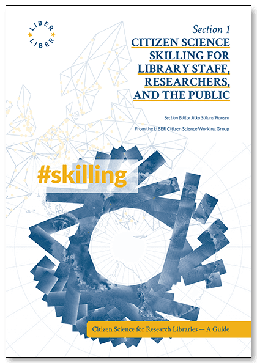

Announcement: Book Launch

November 2021

Citizen Science Skilling for Library Staff, Researchers, and the Public

\#CS4RL

Part of the four-part book series: Citizen Science for Research Libraries — A
Guide

Published by the LIBER Citizen Science Working Group

Section Editor Jitka Stilund Hansen

Open access, read online <https://doi.org/10.25815/hf0m-2a57>

The guide is designed to be a practical toolbox to help run a citizen science
project. It has been put together from contributions by members of the research
library community and has been thoroughly peer-reviewed.

The skilling section focuses on the use of data and this new challenging role
for the library — in public engagement and supporting researchers. The guide
provides several step-by-step guides and concrete project examples. In the guide
you will learn about the different roles for citizens in a project, project
management, communication, the use of data and knowledge provided by citizens,
questions of FAIR data, and how scientific literacy can be used for co-creation
and education in citizen science.

Researchers have been branching out into new areas of citizen science as digital
services have pervaded many parts of people’s lives, such as — wearable health
tracking, using data for COVID19, and for climate change mitigation and
monitoring. Research libraries are in a unique position to offer up the
frameworks and infrastructures built by the open science movement for wider use
by researchers in society.

Citizen science is quite often closely linked to the creation of data. Citizen
science can be used by the researcher to identify which data may answer their
questions, or in increasing scientific literacy in wider society by attracting
citizens and other stakeholders interested in the data: collecting data, telling
the story of the data, or repurposing data.

Citizen science is a key pillar of open science. The *UNESCO Recommendation on
Open Science* for the first time creates consensus on definitions and principles
for open science. Citizen science plays a variety of roles in the overall open
science endeavour of the *democratization of knowledge*.

The guide is part of a themed series of four sections based on the *LIBER Open
Science Roadmap* that cover the essentials to support citizen science projects:
skills, infrastructures, good practice, and programme development.

Artwork and page spreads: <https://github.com/cs4rl/guide/tree/main/artwork>

**Contact:** Co-Editor-in-Chief: Simon Worthington, <simon.worthington@tib.eu>
