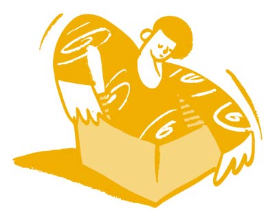

# Foreword

Thomas Kaarsted and Simon Worthington, Co-Editors-in-Chief

The guide series *Citizen Science for Research Libraries* is brought to you by
the LIBER Citizen Science Working Group. The aim of the publications is to
provide access to the new open infrastructures and open science know-how that
libraries have on offer for citizen science projects.

The guide is designed to be a practical toolbox to help run a citizen science
project. It has been put together from contributions by members of the research
library community and has been thoroughly peer-reviewed. The guide is part of a
themed series of four sections based on the *LIBER Open Science Roadmap* that
cover the essentials to support citizen science projects: skills,
infrastructures, good practice, and programme development.

Researchers have been branching out into new areas of citizen science as digital
services have pervaded many parts of people’s lives, such as — wearable health
tracking; data on COVID‑19, energy, or transport; and for climate change
mitigation and monitoring. Research libraries are in a unique position to offer
up the frameworks and infrastructures built by the open science movement for
wider use by researchers in society. In the guide series we are aiming to share
examples of such projects.

Citizen science is a key pillar of open science. The *UNESCO Recommendation on
Open Science* for the first time creates consensus on definitions and principles
for open science. Citizen science plays a variety of roles in the overall open
science endeavour of the *democratization of knowledge* such as — fostering
trust in science, in data gathering and cooperations, and being more equitable —
with our guide offering a contribution in capacity building for such values.

## References

LIBER Open Science Roadmap, <https://doi.org/10.5281/zenodo.1303002>

UNESCO Recommendation on Open Science – URL:
<https://unesdoc.unesco.org/ark:/48223/pf0000378381>

---

Image: Open Doodles by Pablo Stanley.
<https://blush.design/illustration/i/NeXDqiwq2zFLGVeKIy3z>

All illustrations published on Blush can be used for free, Blush license
<https://blush.design/license>
