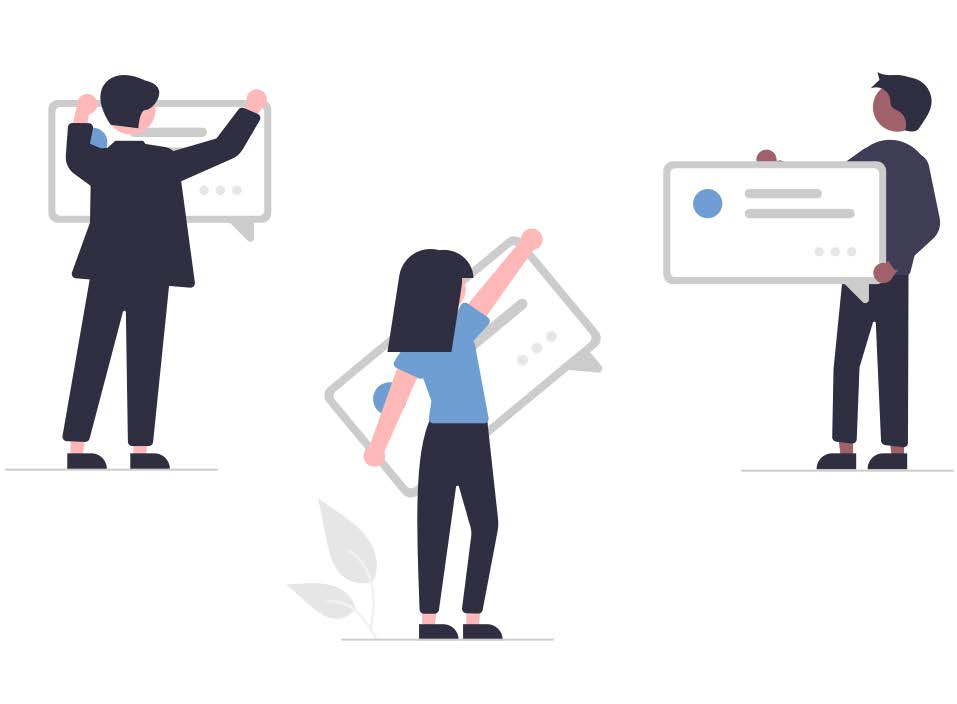
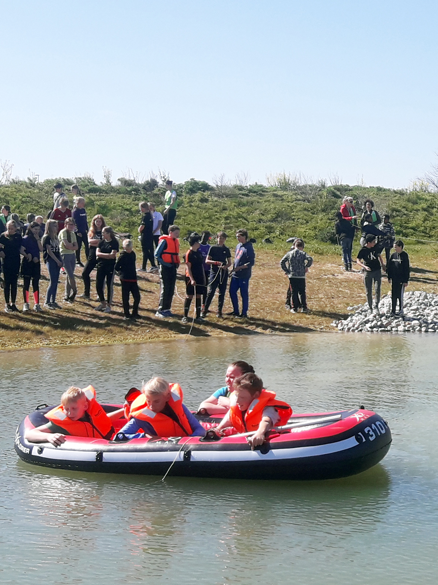

# Communication

**In citizen science, data is communication. Do not only regard data as the
subject matter for analysis but expand it into communicable potential for
dissemination. Citizens are curious and want to know how their data is used.
Therefore, when designing a project, it is imperative you integrate
communication as a tool for dialogue from beginning to end.**

*By Lotte Thing Rasmussen, University of Southern Denmark. ORCID iD:*
[0000-0002-5549-7208](https://orcid.org/0000-0002-5549-7208) *e-mail:*
<ltr@bib.sdu.dk> *Article DOI:*
[10.25815/4834-zs30](https://doi.org/10.25815/4834-zs30)*. This plan stems from
the templates used at SDU for our projects.*

In this section, we focus on communication with citizens. If you want to engage
media or journalists this
[guide](https://www.publicengagement.ac.uk/do-engagement/choose-method/media-engagement)
might be useful. Below we suggest two practical tools for operations:

-   A communication plan

-   A communication log

## Communication to and with citizens

In citizen science projects, the citizens are more than respondents. They are
participants who are invited into a dialogue regarding research. This dialogue
can be conducted before, during and after your project [link: project
management]. This is in order to create motivation, empowerment and potentially
more or better data. Think reciprocity: the citizens donate data, time and
energy. They should receive something in return. When designing your
communication plan, focus on:

-   **Engage in an ongoing dialogue with the citizens involved.** This can be
    via social media, your own channels, website, newsletters etc. and also by
    inviting media and journalists to join the dialogue. At the outset,
    communicate to citizens about the scope and goal of the project. During the
    project, inform and give feedback on the volume of data and be open about
    the analysis of this data, which they have helped provide. Create an
    authentic dialogue. If the data or analysis provide new or even curious
    insights (if not final), these stories might be shared and/or posted. Try to
    communicate in ongoing loops to demonstrate that their data and
    participation is useful.

-   **Enable an ongoing dialogue between the citizens involved.** Very often
    citizen science projects create dialogue to collect data and enable
    co-creation. The knowledge and experiences of participants might be
    valuable. Therefore, it might make sense not only to think of communication
    as a transaction between the researcher and the citizen. Try to enable a
    dialogue between the participants. This might improve motivation, boost the
    collection of data and their possible interpretation. Think about
    communities. Virtual and non-virtual. Consider which communication platform
    would be most appropriate. Social media always plays a vital role today.
    Again, the more traditional media channels and journalists could have a
    stake.

### Communication Plan (Citizens)

The plan can be implemented in the accompanying templates. Depending on the
scope of the project other elements can be added. When identifying your target
group(s), the stakeholder matrix might be a first stop. See the next Project
Highlight for an example.

>   **NB: The project might benefit from a communication plan for internal
>   channels in order to target research communities, management, and groups of
>   colleagues, etc.**

#### Templates for the Communication plan

##### Target groups

|                        | **Name** | **Primary focus/message** |
|------------------------|----------|---------------------------|
| Primary                |          |                           |
| Secondary (if present) |          |                           |
| Tertiary (if present)  |          |                           |

##### Communications channels and theme

| **External channels**                                                                                                                                                                                                                                                                                                                                                                                                                                                                                                                                                                                                                          | **Target groups**                                                                                                                                                                                                                                                    | **Themes and messages**                                                                                                                                                                                                                                                                                                                                                                                                                         |
|------------------------------------------------------------------------------------------------------------------------------------------------------------------------------------------------------------------------------------------------------------------------------------------------------------------------------------------------------------------------------------------------------------------------------------------------------------------------------------------------------------------------------------------------------------------------------------------------------------------------------------------------|----------------------------------------------------------------------------------------------------------------------------------------------------------------------------------------------------------------------------------------------------------------------|-------------------------------------------------------------------------------------------------------------------------------------------------------------------------------------------------------------------------------------------------------------------------------------------------------------------------------------------------------------------------------------------------------------------------------------------------|
| External channels meaning channels of communication that you can edit and post on yourself as well as channels where you might share content – or get editors or moderators to share it for you. Normally, projects benefit from establishing their own digital channels in order to reach relevant target groups. But channels can also be in-person encounters ranging from anything from workshops to town hall meetings. Consider creating information and contact materials. Both digitally across platforms like videos and photos but also in print like e.g. handouts, flyers or even booklets. Make sure to have clear visual design. | Citizens (participants) want an answer to the question: “What’s in it for me?” Don’t necessarily explain every aspect of the project. Begin with the target group and their primary interests. The operative word is dialogue. Meet the target group where they are. | Create targeted content. The purpose and the ‘why’ needs to be clear, when you are engaging citizens: “What is it we want?” A careful thematization with regards to the identified target groups including subgroups and messages can reveal opportunities for direct communication. Different spheres of interest would need different messages. All of the time consider what the citizen needs or is interested in — and what is irrelevant. |
| Web, including citizen science platforms. condary (if present)                                                                                                                                                                                                                                                                                                                                                                                                                                                                                                                                                                                 |                                                                                                                                                                                                                                                                      |                                                                                                                                                                                                                                                                                                                                                                                                                                                 |
| Social media                                                                                                                                                                                                                                                                                                                                                                                                                                                                                                                                                                                                                                   |                                                                                                                                                                                                                                                                      |                                                                                                                                                                                                                                                                                                                                                                                                                                                 |
| Newsletters                                                                                                                                                                                                                                                                                                                                                                                                                                                                                                                                                                                                                                    |                                                                                                                                                                                                                                                                      |                                                                                                                                                                                                                                                                                                                                                                                                                                                 |
| Other                                                                                                                                                                                                                                                                                                                                                                                                                                                                                                                                                                                                                                          |                                                                                                                                                                                                                                                                      |                                                                                                                                                                                                                                                                                                                                                                                                                                                 |

##### Communication log

In order to maintain overview and which methods and dialogue that work, we
recommend doing a log of communication activities. What is communicated to whom
and on which channels or platforms. The log will illustrate a progression or
lack thereof and can be coupled to the collected data if the project wishes to
include that. In the communication plan you write themes and certain angles that
can be useful. In the communication log, you have the specific content.

| **Date**          | **Channel/media** | **Content/message**                                                                                                                                                            | **In charge + status**                                  |
|-------------------|-------------------|--------------------------------------------------------------------------------------------------------------------------------------------------------------------------------|---------------------------------------------------------|
| Date/ week/ month |                   | Primary content: What has been sent out or what is being planned, posted, published etc. Supplementing content: Photos, illustrations, datasets, models, diagrams, videos etc. | Responsible person  Follow-up person  Status on results |

## Project Highlight: Find a Lake

### A Communication plan

“[Find a
Lake](https://www.sdu.dk/en/forskning/forskningsformidling/citizenscience/soer-i-fritiden/find-en-so)”
is a citizen science project at SDU, Denmark, led by associate professor Sara
Egemose. The project aims at involving kids in science in their free time. The
goal of the project is for the researcher to recruit and educate citizens in
collecting data of water quality and insect life to create a dialogue on future
research questions. The project employs a range of citizen science components —
kits, camps, pop up events, and has an app for data collection.

#### Target groups for “Find a Lake”

| **Description**           | **Primary focus/message**                            |
|---------------------------|------------------------------------------------------|
| Kids and their families   | You can become a citizen scientist                   |
| Girls and boy scouts      | You can become a citizen scientist                   |
| After school offers       | You can become a citizen scientist                   |
| Nature guides and schools | This is an important and fun event                   |
| Public libraries          | Let’s do joint events and help us collect data       |
| Think tank Denmark        | Help us engage citizens and collect data             |
| Local Newspaper           | Help us engage citizens and collect data. Share data |
| Environmental agencies    | We share data for decision making                    |

#### Communication channels and themes for “Find a Lake”

| **External channels**         | **Target groups**                                                                           | **Themes and messages**                                                                                               |
|-------------------------------|---------------------------------------------------------------------------------------------|-----------------------------------------------------------------------------------------------------------------------|
| Web                           | All                                                                                         | How to participate, information, booking, data collection, visualization of data                                      |
| Social media                  | Kids and their families Girls and boy scouts Nature guides and schools Public libraries     | You can become a citizen scientist This is important and fun Promotion of events, camps, Pop Up, Citizen Science Kits |
| App                           | All                                                                                         | Data collection How to participate                                                                                    |
| Youtube Channel (videos)      | Kids and their families Girls and boy scouts Nature guides and schools Public libraries     | What is citizen science? How to participate                                                                           |
| Flyers, booklets and roll ups | After school offers                                                                         | This is an important and fun How to participate                                                                       |
| Citizen Science Kits          | Kids and their families Girls and boy scouts Nature guides and schools After Schools offers | Data collection How to participate                                                                                    |
