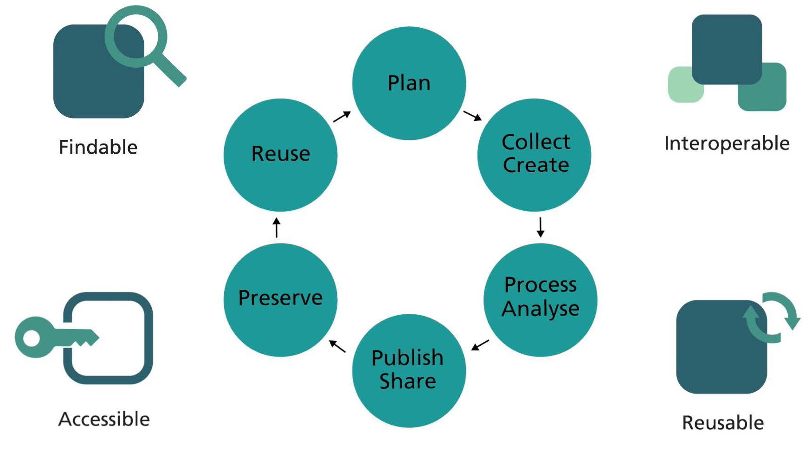

# Research Data Management: Quick Start Guide (eLearning course)

**Introduction to research data management, the FAIR principles and writing a
data management plan**

Watch three short e-learning modules videos on Research Data Management, the
FAIR principles, and Data Management Plans. You will get a general introduction
to the concepts.

-   [Module 1: Introduction](https://doi.org/10.11581/DTU:00000047);

-   [Module 2: FAIR principles](https://doi.org/10.11581/DTU:00000047);

-   [Module 3: Data Management Plans](https://doi.org/10.11581/DTU:00000047).

### References

Holmstrand, K.F., S.P.A. den Boer, E. Vlachos, P.M. Martínez-Lavanchy, K.K.
Hansen, A.V. Larsen, S. Zurcher, et al. “Research Data Management (ELearning
Course),” 2019.  
<https://doi.org/10.11581/DTU:00000047>.
