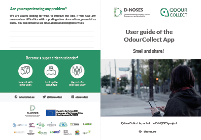
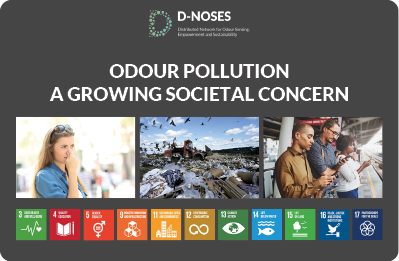

# Citizen Science Data and Standards

**Three recommendations to cope with inherent diversity**

*By Sven Schade and Chrisa Tsinaraki, European Commission – Joint Research
Centre Sven Schade, ORCID iD:*
[0000-0001-5677-5209](https://orcid.org/0000-0001-5677-5209) *e-mail:*
<s.schade@ec.europa.eu> *Chrisa Tsinaraki, ORCID iD:*
[0000-0002-6012-0835](https://orcid.org/0000-0002-6012-0835) *e-mail:*
<chrysi.tsinaraki@ec.europa.eu> *Article DOI:*
[10.25815/jqjc-qp38](https://doi.org/10.25815/jqjc-qp38)

Image: [Undraw.co](http://undraw.co)

Applying standards to citizen science data is important for several reasons.
First, the use of standard methods and tools to gather data helps to ensure the
fit for purpose property, i.e., that the collected data meets the quality
criteria of an intended use. Second, they can ensure that the data collected,
validated or analysed in citizen science activities are provided under the
appropriate access and use conditions — which hold to the participants but also
to others (i.e., any third party that might be interested in re-using or
replicating the work). Hence, standardization is essential for data to be
reusable in other contexts. Third, the use of (domain-specific) data standards
helps to ensure that the citizen science activity covers all important elements
(attributes) of the phenomenon under investigation.

When it comes to specific (data) standards, there are many to choose from. In
the context of citizen science projects, this can be considered an asset,
because citizen science approaches are very rich and diverse, so that there
cannot be a one-size-fits-all solution. However, a few things should be said
about standards and citizen science data, and a few recommendations might help
in advising practitioners and managers of citizen science standardisation
initiatives.

Before anything else, the first recommendation is to avoid assumptions about any
citizen science activity. It cannot be assumed that a citizen science activity
aims at or would benefit from applying a particular standard, or that the
participants are interested in data being re-used by others. Instead, the
participants of any existing or new project need to be consulted to clarify
their intentions and needs. Which (kind of) data will be collected or analysed
by the project? For which purpose? What are requirements in terms of data
accuracy, spatial temporal coverage? Who should have access to the data
collected by the project? Are there any privacy concerns and which agreements
need to be put in place to protect those contributing?

Regardless of the standard(s) that would be used in the project, it is essential
to provide extensive instructions about their use, and to make sure standards
are really understood and adopted by the different participants. Homogeneous
data collection and representation are key for the overall scientific quality of
the activity, so adequate training of participants will be utterly important.
You can include information about standardisation in your communication
strategy.

The second recommendation is to apply those few standards that indeed hold
across any (citizen science) activity — and especially to the data it might
create — those cover topics, such as:

-   Assessment of the need for an ethical review of data gathering and treatment
    methodologies, including the protection of personal data. Existing forms
    (for example, [the dedicated online guide of the European
    Commission](https://ec.europa.eu/research/participants/docs/h2020-funding-guide/cross-cutting-issues/ethics_en.htm))
    might provide valuable insights. If required, ethical reviews might take
    particular attention, for example to control if the people involved are
    informed in the clearest way possible (i.e., not only being directed to long
    and complicated legal texts).

-   A careful assessment of the inclusiveness of the foreseen engagement methods
    and the way those are communicated. Here, it is important to clarify and
    clearly inform about conditions for participation but also which barriers
    this might create to particular communities.

-   The explicit use of standards and, if applicable, of machine-readable data
    licenses (for example, [Creative Commons](https://creativecommons.org/)
    might be used).

-   Generic elements for describing data sets (metadata, such as Dublin Core)
    might be used in addition to any topic specific schemes. A first set of
    elements that are tailored to citizen science are under development [by the
    community](https://core.citizenscience.org/).

-   For data exchange and access, it might be assessed if the use of de facto
    standards for the machine-based exchange of data over the web (e.g., JSON
    and APIs) would add value to the project. This should include an assessment
    of the available technical capabilities of the team. In any case, it is also
    important to ensure that data is provided in ways that are appropriate for
    the targeted participants.

Any additional advice on the use of dedicated standards for data itself has to
be put into context. Standards for citizen science data are highly topic
specific, for example, different approaches have to be taken when using air
quality sensors (see e.g., the [SamenMeten
infrastructure](https://www.samenmetenaanluchtkwaliteit.nl/) — soon also in
English), observing birds (see e.g., the [European Bird
Indexes](https://pecbms.info/european-wild-bird-indicators-2020-update/)), or
collecting and reporting data about litter on beaches (see e.g., [Marine Litter
Watch](https://www.eea.europa.eu/themes/water/europes-seas-and-coasts/assessments/marine-litterwatch)).
The odour pollution case description provides some more details for one selected
example, but generally it is advisable (third recommendation) to engage with
research institutions and/or public administrations that are parts of the
dedicated thematic communities, to learn about their standards and if and how
those might apply to a given citizen science project. The best entity to engage
with will depend not only on the topic, but also on the intended outcome/purpose
of the citizen science project. Public institutions, for example, should be
engaged if there is an ambition that the created knowledge will affect
policy-making – and the right level of administration depends on the intended
outreach (local, regional, national, European or global).

### Standards support interoperability among systems

The university library can be a hub of knowledge for working with metadata and
data standards. It aids the academic disciplines to identify and introduce
existing domain and community dependent metadata standards. Find links and
further resources in the DMP part. [FAIRsharing.org](http://FAIRsharing.org)
collects policies, standards and ontologies from different disciplines that may
be useful also for citizen science.

### References

Schade, Sven, Chrisa Tsinaraki, and Elena Roglia. “Scientific Data from and for
the Citizen.” First Monday, July 31, 2017.
<https://doi.org/10.5210/fm.v22i8.7842>.

Turbé, Anne, Jorge Barba, Maite Pelacho, Shailendra Mugdal, Lucy D. Robinson,
Fermin Serrano-Sanz, Francisco Sanz, Chrysa Tsinaraki, Jose-Miguel Rubio, and
Sven Schade. “Understanding the Citizen Science Landscape for European
Environmental Policy: An Assessment and Recommendations.” Citizen Science:
Theory and Practice 4, no. 1 (December 2, 2019): 34.
<https://doi.org/10.5334/cstp.239>.

Hecker, Susanne, Mordechai Haklay, Anne Bowser, Zen Makuch, Johannes Vogel, and
Aletta Bonn. Citizen Science Innovation in Open Science, Society and Policy.
London: UCL Press, 2018: 321-336.
<https://www.uclpress.co.uk/collections/science/products/107613>.

## Project Highlight: Defining New Data Standards with Citizen Science

**The D-NOSES project applies citizen science and co-creation approaches to set
new standards for odour pollution — globally.**

The EU-funded project [Distributed Network for Odour Sensing, Empowerment and
Sustainability (D-NOSES)](https://dnoses.eu/) is an excellent example of the
diversity of citizen science and data standards. It addresses odour pollution
with the strong aim to influence policies — within countries, the EU and across
the globe. Accounting for around 30% of the environmental complaints globally,
odour pollution is an unregulated issue in many countries. D-NOSES aims to
create scientific references and replicability guidelines for defining new
regulatory frameworks. Among others, the project [reviewed odour pollution and
measurement
techniques](https://dnoses.eu/d2-1_review-on-odour-pollution-measurement-abatement_v3-2-pdf/)
and [compiled a list of good practices in handling odour
pollution](https://dnoses.eu/wp-content/uploads/2021/06/D2.3_Good-practices_v3.1.pdf).
A related [Massive Open Online Course
(MOOC)](https://dnoses.eu/wp-content/uploads/2021/06/D7.4.-MOOC-on-Odour-Pollution.pdf)
was developed to support capacity building. The project highlights that citizen
science can be an integral part in developing standards, especially in domains
where those standards have yet to be defined.

Images: User guide of the OdourCollect App; Policy Brief.  
© 2018 D-NOSES. See: <https://dnoses.eu/downloads/>

However, a few particularities should be noted:

-   In most thematic fields, measurement standards for data gathering and
    exchange already exist. Therefore, citizen science projects have different
    starting points;

-   Regulatory impacts are not always the main driver for a citizen science
    project. Thus, different standards might be needed to address different
    ambitions; and

-   Not all citizen science projects follow the same funding model. Available
    funds and related timelines do constrain the possibilities to learn to use
    existing or even to develop new standards.
