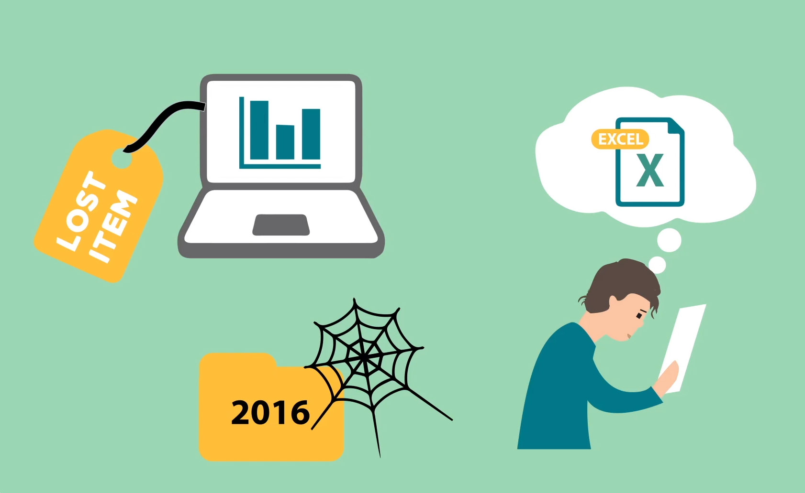

# Planning and Securing Resources — The Data Management Plan

By Iryna Kuchma, Electronic Information for Libraries, ORCID iD:
[0000-0002-2064-3439](https://orcid.org/0000-0002-2064-3439) e-mail:
<iryna.kuchma@eifl.net> Article DOI:
[10.20389/tpap-md16](https://doi.org/10.20389/tpap-md16)

Image: eLearning course about the importance of good research data management
(RDM).  
<https://doi.org/10.11581/DTU:00000047>

A data management plan (DMP) can support citizen science data in becoming FAIR.
It should be created early in the research process and updated regularly to
prepare for data deposit, sharing and reuse. University libraries already have
knowledge of FAIR data. So in this final part about the DMP, we emphasize
resources useful for citizen science projects and in which sections of the
guide, you can find related information. A common understanding of how data will
be managed is particularly important in collaborative projects that involve
researchers, institutions and groups with different ways of working and
expectations.

This guidance follows the six Science Europe core requirements for DMPs (Science
Europe 2021). Also, refer to Wiggins et al. (2013) for writing a DMP for citizen
science projects.

Find [a curated collection of Horizon 2020
DMPs](https://phaidra.univie.ac.at/search#?page=1&pagesize=10&collection=o:1140797)
where several address citizen science projects. If your research library does
not provide a DMP tool, use free online tools for writing DMPs such as
[ARGOS](https://argos.openaire.eu/) or
[DMPOnline](https://dmponline.dcc.ac.uk/).

1. Data description and collection or re-use of existing data

The data description is the core part that you build upon to make decisions on
data management. In this section you include information on the type of data
that will be gathered. To increase the value of citizen science data from the
perspective of the general public (community interoperability) or regulatory
authorities, interoperable data should be planned for. This is important for
integration with existing data or when using existing technologies for data
collection.

Learn more about Citizen Science Data and Standards and about open science.

2. Documentation and data quality

Describing why and how data was collected is important for documenting the data
quality. The data handling skills of the participants may be unknown, therefore,
describe methods used to collect and treat data, data provenance, and
quality-assurance steps taken. Explain how you will guarantee consistency within
your dataset. Metadata standards from relevant disciplines (if existing) are key
for data interoperability and reuse. Ventures in new technology should aim at
following community standards and being open source so later users can implement
and further develop the tools to their needs.

Learn more about Citizen Science Data and Standards. Search
[FAIRsharing](https://fairsharing.org/) for standards, ontologies and policies.

3. Storage and backup during the research process

It is good practice to store data in at least one non-proprietary format.
Project managers often use their personal data storage and the library role
could be to help with the institutional storage provisions or identifying
infrastructures fit for citizen science data. Seek storage solutions, which
offer flexibility and protection for sensitive data or data with disclosure
risk. Best practice is to store data without direct identifiers and replace
personal identifiers with a randomly assigned identifier (ask researchers to
create a separate file, to be kept apart from the rest of the data, which
provides the linking relationship between any personal identifiers and the
randomly assigned unique identifiers). Where possible, select a storage solution
that allows an easy way to maintain version control.

Learn more about infrastructures for Citizen Science in Section 2 of this guide.

4. Legal and ethical requirements, codes of conduct

Citizen science projects might not have access to legal and ethical advice, and
may need help to establish approval mechanisms for sharing data (via consent,
regulation, institutional agreements and other systematic data governance
mechanisms, including restricted access conditions and embargoes if required).
Acknowledge data provenance in metadata and any limitations or obligations in
secondary use, inclusive of issues of consent.

Learn more in Use of Data Policies in Citizen Science Projects and
Acknowledgment of Citizen Scientists on Research Outputs.

5. Data sharing and long-term preservation

Where possible, advice to provide immediate open access to citizen science data
and recommend Creative Commons Attribution 4.0 International License (CC BY
4.0), a Creative Commons Public Domain Dedication or equivalent. Also, clarify
whether any project funder has specific data access requirements. Know the needs
of the participants before you share any data and determine methods for sharing.
If immediate open access is not possible, consider creating a metadata record in
a repository where a persistent identifier and license can be assigned. If data
cannot be open, indicate how they can be made accessible, and under which
conditions. Describe which measures you will take to enable long-term
preservation.

Remember to consult your participants during the project planning and with
regard to their expectations of data sharing (see Citizen Science Data and
Standards).  
Get more information about Use of Data Policies in Citizen Science Projects and
about infrastructures for sharing data in Section 2.

6. Data management responsibilities and resources

Describe who (for example role, position, and institution) will be responsible
for data management. What resources (for example financial and time) will be
dedicated to data management and ensuring that data will be FAIR. Apps or
technologies for data collection and participant interaction may require regular
maintenance and updates – and therefore, funding for long-term support. By
planning early, costs can be significantly reduced.

Identify and assess [RDM
costs](https://www.openaire.eu/how-to-comply-to-h2020-mandates-rdm-costs) and
include them in the project planning.

### References

Science Europe. Practical Guide to the International Alignment of Research Data
Management. (Extended Edition). Brussels: Science Europe, 2021.
<https://www.scienceeurope.org/media/4brkxxe5/se_rdm_practical_guide_extended_final.pdf>.

Wiggins, A, Bonney, R, Graham, E, Henderson, S, Kelling, S, Littauer, R, Lebuhn,
G, Lotts, G, Michener, W, Newman, G, Russel, E, Stevenson, R, Weltzin, J. Data
Management Guide for Public Participation in Scientific Research. DataOne, 2013
[http://safmc.net/wp-content/uploads/2016/06/Wigginsetal2013_DataManagementGuidePPSR.pdf](https://safmc.net/wp-content/uploads/2016/06/Wigginsetal2013_DataManagementGuidePPSR.pdf).
