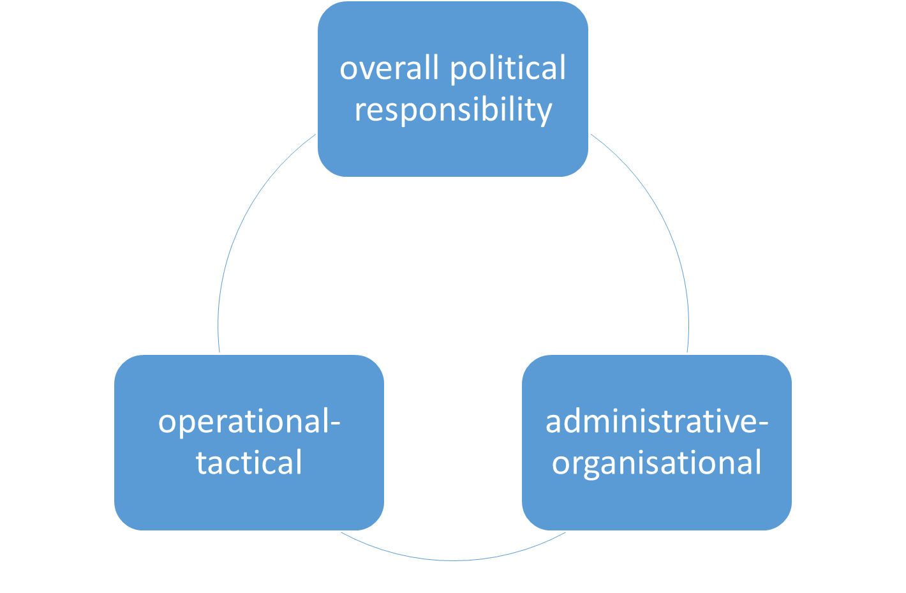
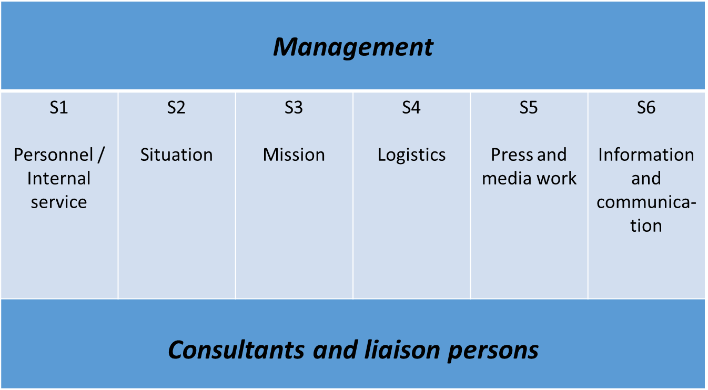
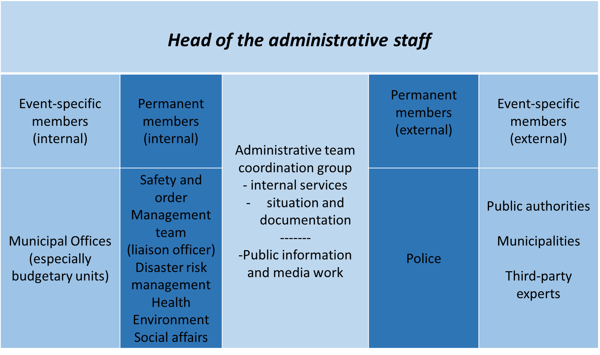
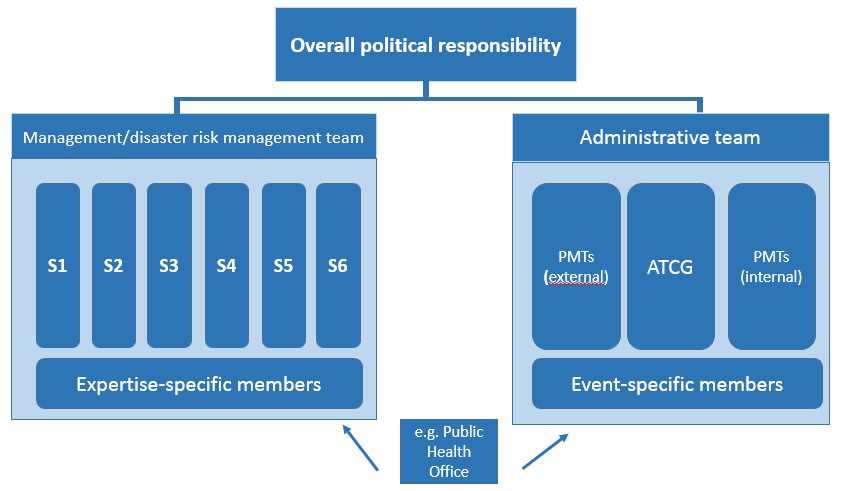
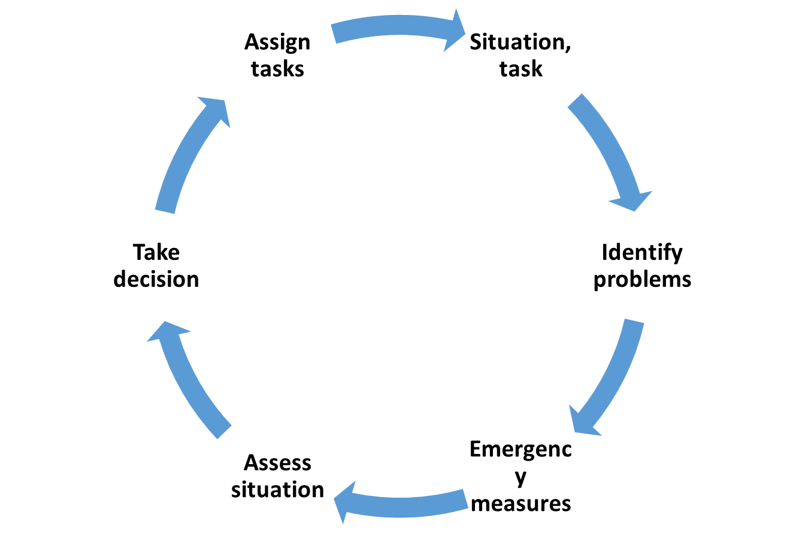

# Working in teams

## Importance of a work/crisis team

Generally speaking, the established administrative structures of the public
health offices, as well as other public health institutions, lack the
preparedness that would enable them to respond effectively e.g. to the
challenges of a biological emergency or crisis swiftly, without errors and under
a uniform management structure. To meet these requirements, when such incidents
occur one obvious option for public health authorities is to operate in team
mode. Operating within the structures of a work/crisis team is similar to
working in projects. When working under a uniform management structure it is
necessary to monitor the performance of tasks, coordinate deadlines and document
decisions.

As well as the measures to cope with the urgent tasks (in a crisis) that result
e.g. from a biological hazard, it must also be ensured that all other vital
sovereign functions (outbreak management, autopsies, reporting etc.) can be
guaranteed as well, possibly with fewer human and other resources. It is then
essential to prioritise tasks.

When the public health office and other public health institutions work together
in teams, it is advisable to take account of the emergency preparedness and
disaster risk management structures that already exist in the administrative
district, city or region. Here it is necessary to clarify whether in a
health-related situation the health sector structures should assume a lead role.
Germany's various regions have different models. In some cases the health sector
takes the lead, while in others joint teams are formed that include the health
and interior/disaster risk management sectors.

## Organisation & management of teams

Responding to emergencies and disasters involves three relevant components of
management:

-   the overall political responsibility component

-   the operational-tactical component and

-   the administrative-organisational component.

In Germany the structures are largely the same at the levels of administrative
districts and independent cities.

Figure 3: Components of management

## The overall political responsibility component

Particularly in large-scale and long-lasting emergencies or disasters, the
individual with overall political responsibility (e.g. mayor, district chief
executive or minister) will assume leadership. This is also the case with
biological emergencies. Within this framework, the individual with overall
political responsibility initiates and holds responsibility for both operational
(operational-tactical) and administrative (administrative-organisational)
measures. Depending on the regulations in force in the federal state, either two
separate teams (one management/disaster risk management team and one
administrative team), or a single overall team that integrates the two areas,
will be tasked to carry out the measures.

## The operational-tactical component

At the operational-tactical level, in emergencies below the threshold of a
disaster (large-scale emergency) the 'management team' is the structure used. In
the case of larger emergencies above the disaster threshold the 'disaster risk
management team' is mobilised. The two teams usually comprise the same members.
A management team may have fewer team members, however. Team structures are
enlarged in proportion to the scale of an emergency incident.

## Official regulation DV 100 'Leadership and command in emergency operations'

In Germany, all disaster risk management organisations (fire service, emergency
services, police/regulatory authorities and relief organisations) also operate
in team mode in emergency operations, each according to the same type of
official regulation (e.g. the [fire service regulation 'Leadership and command
in emergency
operations](https://www.bbk.bund.de/SharedDocs/Downloads/BBK/DE/FIS/DownloadsRechtundVorschriften/Volltext_Fw_Dv/FwDV%20100.pdf)**'**
(FwDV 100). To enable the health authorities to find their way round this
structure it is important to integrate it into the emergency and disaster
response system early on.

In Germany, at the level of cities and administrative districts the respective
official regulation is *the* management instrument for all emergency and
disaster response agencies. The official regulation integrates all
representatives of the key areas of emergency and disaster response and health
care into a single management framework with equal responsibility.

A management or disaster risk management team takes care of all the
operational-tactical measures that arise, e.g. formation of sections, provision
of personnel and reserves, or the establishment and operation of a communication
structure.  

Figure 4:  Structure of a management team

In general, the following staff functions (S) should be established in both
teams:

-   **S 1 (Personnel)** steers all operative personnel.

-   **S 2 (Situation)** collects all facts needed to assess the situation. Staff
    function S2 also includes the mission diary and review functions.

-   **S 3 (Mission)** coordinates and monitors all operational tasks. It is also
    responsible for task control.

-   **S 4 (Logistics)** steers all logistics activities and the required
    materials.

-   **S 5 (Press and media work)** coordinated the press and media work with all
    stakeholders.

-   **S 6 (IT and communications)** provides IT services and all communications
    technology.

When incidents (e.g. escape of a chemical substance) occur, the public health
office can provide expert advisors and liaison persons for the
management/disaster risk management team.

The aforementioned staff functions are described in more detail in the section
'Tasks of the staff functions'.

## The administrative-organisational component

Depending on the regional provisions, as well as a management/disaster risk
management team there may also be an administrative team that functions either
as a stand-alone unit or in conjunction with the management/disaster risk
management team. When the two teams operate together they form a single unit.
While the management/disaster risk management team covers the
operational-tactical component, the administrative team deals with the
administrative-organisational side of disaster risk management. Under
time-critical conditions and taking all aspects into account, the administrative
team is there to take decisions for which the management/disaster risk
management team is not responsible due to legal requirements, financial
responsibilities and political frameworks. These include e.g. decisions on
closing public institutions and facilities.

To enable a supra-regional, standard organisational structure a document (German
only) has been published for Germany's regional states entitled [Forming
teams](http://www.bbk.bund.de/SharedDocs/Downloads/BBK/DE/FIS/DownloadsRechtundVorschriften/IMKBeschluesse/IMK174TOP26Anlg2.pdf)
[–](http://www.bbk.bund.de/SharedDocs/Downloads/BBK/DE/FIS/DownloadsRechtundVorschriften/IMKBeschluesse/IMK174TOP26Anlg2.pdf)
[the administrative-organisational
component](http://www.bbk.bund.de/SharedDocs/Downloads/BBK/DE/FIS/DownloadsRechtundVorschriften/IMKBeschluesse/IMK174TOP26Anlg2.pdf).
This advice it contains applies to the work of teams both in large-scale
emergencies and in case of disaster. Some of Germany's regional states are
already using this component for incidents below the threshold of a large-scale
emergency.

According to this advice the administrative team should include representatives
of all departments necessary/responsible for managing the emergency in the
regional administration, other public authorities and third parties with
relevant expertise. As well as permanent members of the team, which also include
representatives of the public health office/public health authority as expert
advisors, the team will also include incident-specific members. These might also
be non-governmental actors (e.g. electricity providers in the event of a power
failure). The graphic below – 'Structure of an administrative team' – provides
an overview of the composition of an administrative team:

Figure 5: Structure of an administrative team

The 'team leader' is responsible for leading and coordinating the administrative
team. This individual takes decisions on measures to be introduced, defines
objectives, and decides on the appointment of further situation-specific
members. If political responsibility does not rest with the administrative team
leader, the team leader decides which measures will be determined within the
team and which ones by the body with overall political responsibility.

The **administrative team coordination group (ATCG)** comprises the sections
**internal services** and **situation and documentation**. The **internal
services** section alerts team members and when necessary updates the team's
official regulations, as well as the alert and contact data lists. It also
ensures that the team is operational, i.e. availability of resources, reordering
of materials, organisation of rooms and meetings. The ATCG section **situation
and documentation** is responsible for requesting, collating, evaluating and
documenting information and reports on the situation and reports. It also keeps
the mission diary, and is responsible for describing the situation and
forecasting future development.

The **public information and media work (PIMW)** function coordinates, supports
and informs the press and other media, e.g. by preparing press briefings,
evaluating press releases or setting up a public hotline.

**Permanent members of the team (PMTs)** assess the incident from their own
expert perspective, describe problems and hazards from their perspective, and
identify options and proposals for expedient measures. The PMTs are
representatives of necessary departments, public authorities or third parties
who possess decision-making authority. The areas usually represented are public
safety and order, disaster risk management, health, environment, the police
force and social affairs. Depending on the situation, further departments may be
involved such as construction and housing supervision (e.g. in case of fires),
the education authority etc. A member will also be appointed to liaise with the
management team.

As with the PMTs, **event-specific members of the team (ESMTs)** also bring
their specific expertise to bear in assessing and managing the situation. They
are selected according to the situation, and comprise representatives of
departments of the sub-regional authority's own administration, other public
authorities, municipalities or third parties with relevant expertise, who are
authorised to take decisions. In Germany the latter include for instance the
fire department; aid organisations; the Federal Agency for Technical Relief
(THW), the Bundeswehr; energy utility companies and transport companies. The
ESMTs can to some extent perform their task within the scope of their normal
work, and need not be permanently present on the administrative team.

## Cooperation between the teams

The graphic below provides an overview of how the teams work together when
crises occur:

Figure 6: The teams

## The crisis team in the public health office

In the event of a crisis, the public health office's work/crisis team is
basically a supplementary organisational structure within the office which is
there to support the director, who will usually represent the public health
office on the management or disaster risk management team.

The public health office team itself usually does not perform a management role.
Instead it coordinates and designs the measures as instructed by the director of
the public health office. In case of limited biological emergencies, however, it
can and should also act autonomously. When more major hazards arise, on the
other hand, it is a supportive element that reports to the director on the
management/disaster risk management team.

Public health offices perform both administrative-organisational tasks, such as
coordination and decision-making on specialist tasks within their own sphere of
responsibility, as well as operational-tactical tasks such as the formation of
focal areas of operation, the deployment of personnel and the management of
logistics.

Depending on circumstances with regard to human resources, the structure of the
team in public health officers should be based on the German fire service
regulation FwDV 100. If the hazards and the tasks faced by the team so require,
further in-house personnel can be provided to support the team, or if necessary
additional personnel can be brought in from other departments. Where expedient
for the performance of tasks, team functions should be amalgamated.

For the crisis team to become operational, a certain basic infrastructure first
has to be created. The crisis team requires a suitable room with appropriate
facilities, including information and communication technology. Several things
should always be available, while others can be provided as the occasion
demands.

The checklist for ‘Infrastructure and equipment in a crisis team' provides
suggestions that you can use when setting up a crisis team.

## Crisis management at the level of the supreme regional authorities

Germany's federal state ministries and their subordinate general and specific
regional authorities are each responsible for preventing and responding to
crises within the scope of their respective remits. When a national response is
required in case of looming biological emergencies, when damage has occurred or
in case of disasters, the teams of these public health authorities may be called
upon.

In some cases these teams assume a lead role based on the 'lead ministry
principle', while in other cases joint teams are formed by the ministries of
health and the interior. In case of health-related emergencies, the federal
state ministries of health can usually propose calling up the team of the
regional government. On this team the ministries concerned then work together
within the scope of their respective remits and deal with the tasks on the basis
of lead ministerial responsibility.

## Modus operandi in the team

The team operates on an objectives-oriented basis, in closed iterative
conceptual planning and implementation loops. The iterative approach ensures the
necessary assessment of the situation and adoption of resolutions.

Figure 7: How the crisis team works

## Functions and tasks in the crisis team

The staff functions and tasks in the crisis team are shown in the following
table. They are based on the example of fire service regulation FwDV 100:

| **Function**                | **Tasks**                                                                                                                                                                                                                                                                                                                                                                                                                             |
|-----------------------------|---------------------------------------------------------------------------------------------------------------------------------------------------------------------------------------------------------------------------------------------------------------------------------------------------------------------------------------------------------------------------------------------------------------------------------------|
| S 1 (Personnel)             | Alert personnel on duty Alert personnel off duty Monitor alerts Manage personnel lists Monitor working hours Provide reserve personnel (in case of protracted operations) Notify and request support from public officers, public authorities, organisations                                                                                                                                                                          |
| S 2 (Situation)             | **Ensure information flows** Notify superior authorities Notify in-house staff on a regular basis Notify other agencies **Document operations** Keep the mission diary Collect, save and keep a record of information material Prepare a final report                                                                                                                                                                                 |
| S 3 (Mission)               | Assess the situation Conduct operations, e.g. define key areas of operation Define needed human resources, material resources and reserves Ensure management within the framework of the operational plan (management structure) Conduct discussions of the situation Assign and monitor tasks Work together with other public offices, public authorities and organisations                                                          |
| S 4 (Logistics)             | Request further operating resources Draw on additional resources Provide expendables and operating resources Provide and supply meals and lodging Define supply structures Provide personal protective equipment for staff                                                                                                                                                                                                            |
| S 5 (Press and media work)  | **Inform the press and the media** Collect, select and process information from operations Capture, document and evaluate the press and media situation Prepare information for the press and the media **Support the press and the media** Inform, guide and accommodate representatives of the press and the media Prepare and hold press conferences Set up and support public hotlines Issue warnings and missing person messages |
| S 6 (IT and communications) | **Plan the use of IT and communications, design a communications strategy, ensure its operationalisation** Operationalise IT, operationalise communications strictures Guarantee communications security (redundancy) Monitor operation of communications **Equip incident management with office communications**                                                                                                                    |
