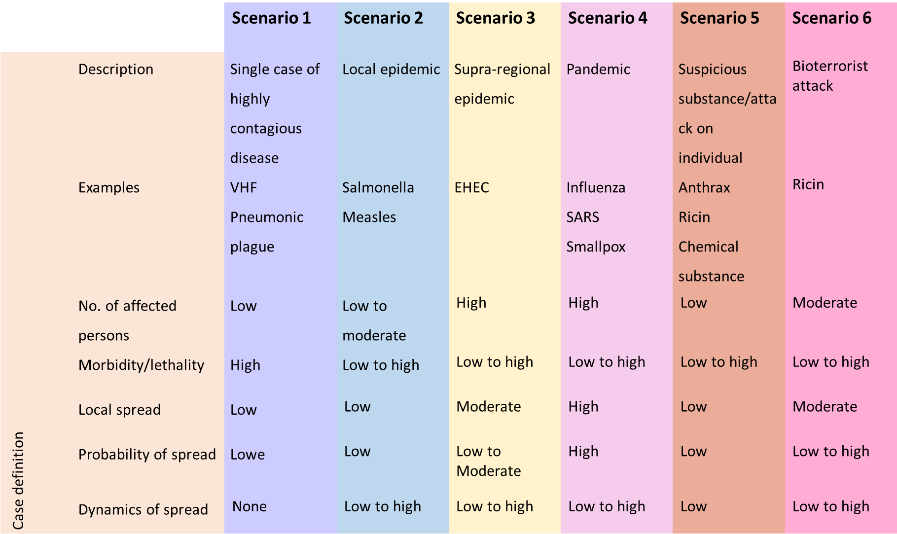

# B scenarios

## Various B scenarios

We will begin by looking at biological emergencies, which are also referred to
as B scenarios. These are per se highly diverse.

A distinction is drawn between the following six types of scenario:

1.  Single case of a disease involving highly pathogenic agents

2.  Local epidemic

3.  Supra-regional epidemic

4.  Pandemic

5.  Discovery of a suspicious substance/attack on individuals

6.  Bioterrorist attack

## Risk assessment

The term 'biological emergency' usually refers to the spread of infectious
agents or corresponding toxins. To assess the risk in an acute situation it is
helpful to identify the biological agent. A distinction needs to be drawn
between whether the outbreak is taking place for instance in hospital, where the
agent/hazard is usually known, or whether the situation involves an increased
incidence of disease with similar presentations, the cause of which is unclear
(both most closely resemble scenario 2 in the graphic 'Overview of different
scenarios'). The latter would be conceivable for instance in a care home where
there was an increased incidence of gastroenteritis symptoms. Another
possibility here is the risk posed by 'bioterrorism' where the status in those
affected is (still) unknown (comes closest to scenario 5 in the graphic
'Overview of different scenarios'). Here it is also crucial to have the right
laboratory testing facilities available. Existing rapid tests are only partially
reliable, particularly with environmental samples, and can produce both false
positive and false negative results. To assess the risk it is therefore always
necessary to have samples analysed in an experienced laboratory.

**N.B.: Although the overwhelming majority of outbreaks have a natural cause,
when assessing the risk the possibility of intentional release should always be
considered.**

Also include the following criteria:

1.  Routes of infection

2.  Treatment options

3.  Available protective measures

4.  Likelihood of spread

One option for performing a risk assessment prior to an emergency would be to
produce a [matrix of the extent of damage and likelihood of
occurrence](https://www.bbk.bund.de/SharedDocs/Downloads/BBK/DE/Downloads/Krisenmanagement/matrix_abb.html)[,](https://www.bbk.bund.de/SharedDocs/Downloads/BBK/DE/Downloads/Krisenmanagement/matrix_abb.html)
for example.

A risk matrix can help assess the anticipated scope of damage, as shown in the
graphic 'Overview of different scenarios' (source: **Generic plan for biological
emergencies** – based on 5 scenarios; version 2.0 \| Senate Department for
Health and Social Services – graphic modified in scenarios 5 and 6).

Figure 8: Overview of different scenarios

To assess the risk it is also necessary to define the objective that can be
achieved in the respective situation. At the beginning of an epidemic, for
example, the objective may be to prevent or at least delay the outbreak. Once an
epidemic has taken hold, on the other hand, the focus may be on maintaining the
life of society.

## Measures

The transitions between the three phases described below are smooth, hence when
assessing the risk it will be necessary to gradually adjust the measures
employed. See the information published by the RKI in its Epidemiological
Bulletin 7/2020 on [Objectives of infection control
measures](https://www.rki.de/DE/Content/Infekt/EpidBull/Archiv/2020/Ausgaben/07_20.pdf)**.**

## Containment

In this phase an attempt is made to identify every infected person as soon as
possible and isolate them immediately. All contacts are traced and placed under
observation or where appropriate on the quarantine (especially with diseases
where others can be infected before symptoms begin), in order to break the chain
of infection as quickly as possible.

This strategy aims to eradicate the pathogen. If this is not possible, an
attempt should be made to gain time for the best possible preparation, e.g. to
develop therapeutic options and/or vaccines, to conduct studies on the
properties of the pathogen, to increase treatment capacities in hospitals and to
time the outbreak so that it does not coincide with other infection events (e.g.
the annual 'flu wave').

## Protection of vulnerable groups

Once it is no longer possible to prevent the spread of the pathogen, protection
then focuses on individuals and groups with an elevated risk of severe disease.

### Mitigation

If the disease becomes so widespread that the strategy of protecting
particularly vulnerable groups is no longer possible, measures then focus on
mitigating further negative impact on the public and on mitigating the impact on
the life of society.

## Situation-specific communication

Particularly at the beginning of a biological emergency, it must be assumed that
it is not known what properties the pathogen possesses or even which pathogen it
is. This uncertainty must also be communicated. It must be made clear which,
what is being assumed and what further investigations are underway in connection
with that.

One particular concern in communication on infectious diseases is the fact that
members of the public suddenly see their neighbours/fellow human beings as a
threat. It is therefore very important to provide information on routes of
infection and protective measures. If a shortage of protective means is
foreseeable, priorities will also need to be set. These must be weighed up very
carefully and communicated clearly – if possible before a crisis arises. In
'quiet times' almost anyone will agree that in a medical crisis, medical
personnel who take care of the sick must be given preference for prophylaxis.

Concerning risk communication and crisis communication please refer to the
**chapter ‘Communications’**.

## Alert system, notification channels

In Germany, pursuant to the Protection against Infection Act (IfSG) physicians,
heads of facilities and laboratories are obliged to notify the responsible
health office forthwith. The health offices are obliged to notify the supreme
regional health authority, which in turn notifies the RKI. A prerequisite for
this is 24/7 availability. Pursuant to Section 25 in conjunction with Section 16
of the IfSG, the health office shall without delay conduct investigations into
the source of the pathogen and into patient contacts. It shall also define
measures to prevent spread (prohibition of activities/visits, observation,
isolation in the home, or e.g. isolation in an appropriate hospital pursuant to
Section 30 (6) IfSG....).

A joint decision should be taken together with the treating facility, the press
office and the supreme regional authority as to how and when the public shall be
informed. To this end a press conference should be convened at short notice.
Responsibilities will be defined beforehand: Who will leave the press
conference, who will say what, and on which topics?

For further information on the alert system and notification procedures please
refer to the sections 'Alert system' and 'Notification channels' in the chapter
'Operational planning'.

## Management structure

The management structure for crises is described in detail in the **chapter
'Operational planning'**.

## Actors and tasks

In biological emergencies primary responsibility rests with the health office,
which must perform numerous tasks in this situation.

Examples include:

1.  Risk assessment

2.  Risk and crisis communication

3.  Internal communication

4.  Public information

5.  Preparation of press work, possibly setting up of hotline  
    Contact tracing, definition of anti epidemic measures pursuant to IfSG,
    categorisation of contacts  
    Routine epidemiological surveillance

6.  Occupational safety and health, ensuring provision of personal protective
    equipment

7.  Ordering of diagnostic measures and decision on scope of investigation

8.  Protective measures to reduce contacts  
    Instructions on behavioural measures  
    Organisation and monitoring of patient  
    Regulation of sampling and transport of samples

9.  Information and advisory tasks for other authorities, facilities and the
    public

10. Definition and monitoring of isolation arrangements

11. Decision-making on nature and scope of disinfection measures and their
    monitoring, as well as expert advice

12. Possibly decision-making on decontamination measures  
    Ordering of isolation by the medical officer

13. Ordering of autopsy, certification of death, oversight of transport of
    corpses and cremation

14. Disposal management

15. Possibly coordination of vaccinations

16. Possibly coordination of post-exposure prophylaxis  
    Documentation and evaluation

As well as the health offices, the regional authorities and health ministries
are also involved when an incident occurs. Each federal state has its own
specific rules governing precisely which tasks they perform in an emergency.

The RKI is a scientific-cum-medical institution of the German Government with a
mandate for public health. It is responsible for fighting communicable diseases.
The RKI plays a special role in further developing methods and designing
scientific standards, e.g. for investigating suspected cases of the deliberate
release of pathogens, which are referred to it as the designated body. In
accordance with statutory provisions, the RKI advises primarily the professional
public and policymakers. Nevertheless, it also sees its task as being to inform
citizens and patients on infection risks and health trends, or refer them to
other sources of information. In order to respond appropriately to a threatening
situation or one perceived as such, and improve their own health situation, as
many interested parties as possible should be able to form their own opinion. To
facilitate this, in 2016 the RKI published further information in its brochure
[Protecting Health – Assessing Risks.](https://edoc.rki.de/handle/176904/5453)

The [Permanent Working Group of Competence and Treatment
Centres](https://www.rki.de/DE/Content/Kommissionen/Stakob/Stakob_node.html)
[(STAKOB)](https://www.rki.de/DE/Content/Kommissionen/Stakob/Stakob_node.html)
is another important actor in biological emergencies. STAKOB is a Germany-wide
network of experts for the management and care of patients with high consequence
infectious diseases. The competence centres possess special expertise in the
field of public health, while the treatment centres specialise in the clinical
care of patients with highly pathogenic, life-threatening diseases in special
isolation units. STAKOB Can also be contacted for advice by telephone.

Other actors are the various health care providers. These include doctors'
offices (outpatient care) and hospitals (inpatient care). Laboratories and
pharmacies are also involved.

Finally, in an epidemic – and in a pandemic – all employers, together with the
responsible company doctors, have these occupational safety and health tasks.

Particularly when a bioterrorist attack is suspected, other actors are also
involved:

1.  the police, to determine whether the suspicion is warranted. They will
    assess whether there is a serious threat. If they find that there is,
    further measures are necessary such as ruling out explosives. The police
    will then be responsible for cordoning off the crime scene and identifying
    the perpetrators.

2.  the fire brigade in case of a biological emergency, in order to prevent the
    further spread of biological agents. The fire brigade will often assume
    responsibility for taking samples on behalf of the medical officer.

3.  the [Analytical Task Force
    (ATF)](https://www.bbk.bund.de/DE/AufgabenundAusstattung/CBRNSchutz/ATF/ATF_node.html)
    has
    been equipped with special measurement technology by the Federal Office for
    Civil Protection and Disaster Assistance. ATFs are stationed 10 locations in
    Germany. They can deploy anywhere they are called to within a maximum of
    three hours. If powder is found they are responders of choice for
    measurements to rule out the presence of chemical substances or
    radio-nuclear materials.

## Resources

### Staff

The key resource in biological emergencies is staff. Here there needs to be a
focus on measures for occupational safety and health (personal protection
measures).

In biological emergencies, a shortage of medical personnel trained in the use of
personal protective equipment (PPE), including emergency service personnel, can
arise very quickly. The shortage of trained staff is further exacerbated when
the infection protection set is used, due the short time for which it can be
worn and the physical strain it places on the individual wearing it.

## Personal protective equipment (PPE)

In the event of a Germany wide-crisis,, PPE will very quickly be sold out.
Accordingly, precautionary steps must be taken to stockpile sufficient
quantities of PPE (**BUT: Remember that PPE has a limited shelf life**).

What constitutes a sufficient quantity is dependent on the risk assessment, what
scenarios are to be expected and what dimensions they might assume within your
sphere of responsibility. You also need to take into account the wearing times.
As described in the 'Toolbox' chapter with respect to occupational safety and
health, per suit the infection protection set is much cheaper than a suit with a
blower unit. However, since the set can only be worn for a short time – a
maximum of two hours, and for wearers who lack experience significantly less –
consumption is much higher.

## Packaging materials for samples

To be able to ship samples quickly and safely in a biological emergency, you
should keep a sufficient stock of packaging materials (P620). Incorrect
packaging material can also cause sample material to leak out of the package and
thus contaminate people.

Furthermore, 'improvised' packages can be difficult for laboratory personnel to
open, thus wasting valuable time.

### Other resources

Other resources, such as medicines for PEP and therapy, isolation facilities,
staff to monitor domestic quarantine, and hospital capacities – especially beds
with ventilators and isolation beds – are covered in the 'Toolbox' chapter.

## Outpatient care

Outpatient care plays a major role in Germany's influenza pandemic planning and
its planning for COVID-19. The RKI's pandemic preparedness plan states

>   'To safeguard the needed resources for inpatient treatment in cases of
>   severe disease, care should continue to be provided on an outpatient basis
>   for as long as [possible." (Structures and measures,
>   national](https://edoc.rki.de/handle/176904/187) [pandemic preparedness
>   plan, RKI)](https://edoc.rki.de/handle/176904/187)

Concerning the management of suspected COVID-19 cases, the RKI states

>   'In certain situations in which inpatient admission is not necessary from a
>   clinical point of view, if certain conditions are met (see table) this can
>   be performed in outpatient care." [(Notes on the outpatient management of
>   suspected COVID-19cases, RKI, as at 27 February
>   2020).](https://www.rki.de/DE/Content/InfAZ/N/Neuartiges_Coronavirus/ambulant.html)

The organisation and risk management of outpatient care should be planned before
a crisis arises.

>   'Beyond the provision of basic services, responsibility for outpatient care
>   lies with the associations of statutory health insurance physicians as part
>   of the obligation to ensure care pursuant to Section 72 of Volume 5 of the
>   German Social Insurance Code (SGB V)'. [(Structures and measures, national
>   pandemic preparedness plan](https://edoc.rki.de/handle/176904/187) [part 1,
>   RKI)](https://edoc.rki.de/handle/176904/187)

To ensure the quality of outpatient care it is urgently necessary to provide
doctors in private practice with information materials geared specifically to
their work. These should comprise practical handouts, e.g. on taking case
histories, providing counselling, sampling, diagnostic laboratories, and
protective measures for the doctor, their staff and other patients. The
published recommendations of the German Medical Association and the Statutory
Accident Insurance Association for Health and Welfare Services (BGW) include
special instructions for [risk management in medical
practices](https://www.bundesaerztekammer.de/fileadmin/user_upload/downloads/Risikomanagement_in_Arztpraxen.pdf)**.**

## Hospital allocation, inpatient care

When the number of persons injured exceeds the immediately available resources
of the emergency services, the term 'mass-casualty incident' (MCI) is used. This
textbook will provide more information on this, and on screening and hospital
allocation, later on.

In Germany, which hospital allocation systems are used when the emergency
services are working normally varies from region to region. In what biological
emergencies the allocation systems seem appropriate for routine operation/MCI,
or whether alternative allocation systems should be used, needs to be defined.

Ideally an allocation system will be interlinked not only with inpatient care,
but also with the outpatient sector. It will then be possible to alleviate
pressure on the inpatient sector when necessary.

Extensive preparations are also required in the inpatient sector. The RKI's
pandemic preparedness plan states

>   'It is especially important to ensure that the admission and care of
>   influenza patients are physically separate from general patient care, and
>   that additional bed capacities are created, for instance by postponing
>   elective [operations.'](https://edoc.rki.de/handle/176904/187) (Structures
>   and measures, national pandemic preparedness plan [part 1,
>   RKI)](https://edoc.rki.de/handle/176904/187)

Concerning the need for personal protective equipment (PPE), see the **chapter
'Toolbox'**. It is also important to consider the increased need e.g. for
medicines.
