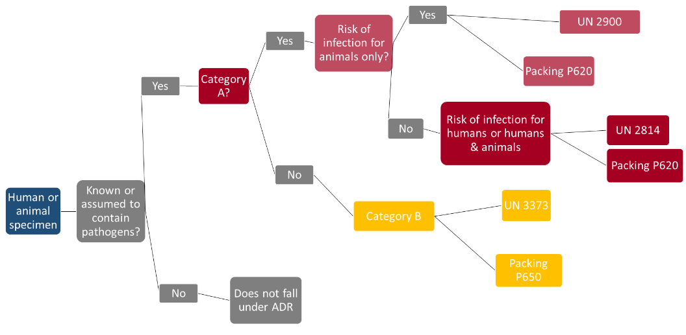

# Toolbox

This toolbox describes in detail technical and logistical measures that may be
necessary in biological emergencies.

The **technical measures** include

-   Diagnostics

-   Occupational safety and health/personal protective equipment (PPE)

-   Surveillance

-   Disinfection measures

-   Protective measures

-   Isolation

The **logistical measures** include:

-   Patient transport

-   Sample management

-   Therapy and vaccination strategy

-   Handling of corpses

-   Disposal management

The information contained here is of a generic nature. For numerous pathogens
there are specific recommendations, which can be found e.g. on the RKI website
under [Infektionskrankheiten A-Z
(](https://www.rki.de/DE/Content/InfAZ/InfAZ_marginal_node.html)[Communicable
diseases
A-Z](https://www.rki.de/DE/Content/InfAZ/InfAZ_marginal_node.html)[)](https://www.rki.de/DE/Content/InfAZ/InfAZ_marginal_node.html),
and on the websites of the federal state authorities or  where appropriate the
respective competent authorities.

## Technical measures

### Diagnostics

Diagnosing the disease is an essential part of assessing which therapeutic and
epidemiological measures are necessary. Diagnostics encompasses taking the
patient's case history, performing a physical examination and performing
examinations using apparatus, including laboratory analysis. In many
communicable diseases, diagnosis is made more difficult by the fact that when
the disease begins the symptoms are often so unspecific that laboratory tests
are needed in order to confirm the diagnosis.

Accordingly, the requirements for laboratory diagnostics are as follows:

-   High sensitivity: it must be possible to detect minimum amounts of a
    pathogen, in order to avoid false negative results

-   High specificity: it must be possible to clearly distinguish between similar
    pathogens/antigens, in order to avoid false positive results

-   High stability: minimum effect of factors that might falsify the result by
    producing false positives or false negatives (e.g. inhibitors)

-   High rapidity: shortest possible time until test result is available, so
    that the right measures can be taken as quickly as possible

Optimal diagnosis requires proper sampling, as well as the right packaging and
shipment (also described in this toolbox). In order not to lose any unnecessary
time in a crisis, the teams managing the crisis should be aware of corresponding
laboratories within their sphere of responsibility. They should also know what
range of diagnostic services the laboratories provide and have their contact
details. To help make the process smooth one it is a good idea to discuss
something with the laboratory – and in particular to determine which type of
samples are most appropriate. The laboratory should also be notified in advance
so that it can begin preparatory measures before the sample arrives.

At the beginning of an outbreak or in the case of diseases with high lethality,
it is necessary to diagnose every single case. In the course of an epidemic,
however, overstretched laboratories or clear epidemiological links may
necessitate diagnosis based on case definitions, which are actually designed to
ensure standard criteria for the surveillance of communicable diseases
Germany-wide.

## Occupational safety and health/personal protective equipment

### Basics

In Germany, work with biological agents is governed by the [Biological Agents
Ordinance
(BioStoffV)](http://www.gesetze-im-internet.de/englisch_biostoffv/englisch_biostoffv.pdf),
which aims to ensure safety and health protection at workplaces. The [Committee
on Biological Agents
(ABAS)](https://www.baua.de/EN/Tasks/Committee-administration/ABAS/ABAS_node.html)
at the Federal Ministry of Labour and Social Affairs uses the Ordinance to
determine the state of the art in science, technology, occupational medicine and
occupational hygiene, and makes this information available in the form of
[Technical Rules
for](https://www.baua.de/EN/Service/Legislative-texts-and-technical-rules/Rules/TRBA/TRBA.html)
[Biological Agents
(TRBA)](https://www.baua.de/EN/Service/Legislative-texts-and-technical-rules/Rules/TRBA/TRBA.html).

These cover:

-   General information, structure and application

-   Activities involving biological agents (e.g. protective measures in
    laboratories, in acute biological emergencies, solid waste, waste water,
    health care)

-   Assessing hazards (e.g. classification into risk groups)

-   Hygiene and disinfection measures

-   Decisions of the ABAS on requirements for activities involving biological
    agents in special cases (e.g. tuberculosis, polio, influenza, highly
    pathogenic agents).

The TRBAs are designed to support the optimal implementation of occupational
safety measures. They are not statutory regulations. It is therefore possible to
apply other measures that have the same effect on safety.

Occupational safety and health operates on the principle that structural
measures should be considered before organisational measures, and organisational
measures before personal measures. Accordingly, a risk assessment should be
performed and appropriate protective measures defined prior to any activity. The
principle of maximum protection need not be applied in all cases, as this would
place an unnecessary burden on the institution, and in the worst case might even
contribute towards patients not receiving optimal care.

### Personal protective equipment (PPE)

The TRBAs describe the requirements for personal protective equipment (PPE),
e.g. in [health care and welfare facilities (TRBA
250)](https://www.baua.de/DE/Angebote/Rechtstexte-und-Technische-Regeln/Regelwerk/TRBA/TRBA-250.html)
or for the [care of patients infected with highly pathogenic organisms outside
of special isolation units (Resolution
610)](https://www.baua.de/DE/Angebote/Rechtstexte-und-Technische-Regeln/Regelwerk/TRBA/Beschluss-610.html).
The TRBAs list numerous standards that the PPE must meet. When procuring PPE it
is advisable to require the manufacturer to meet the specified standards, as
this will guarantee compliance with the scientific state of the art.

Protective equipment is manufactured and classified in accordance with
[Directive
89/686/EEC](https://eur-lex.europa.eu/legal-content/EN/TXT/?uri=celex%3A31989L0686)
(Council Directive of 21 December 1989 on the approximation of the laws of the
Member States relating to personal protective equipment). For protection against
mortal hazards or serious irreversible injury, category III is used.

When selecting PPE, a basic distinction can be drawn between the infection
protection set, which comprises various components, and a protective (hazmat)
suit with powered air-purifying respirator, which often comprises a one-piece
protective garment with an external blower.

The advantages of the infection protection set are listed as the low price per
set and low maintenance requirement. The advantages of the protective suit are
the greater comfort, longer wearing times, greater ease of communication when
using a headset, no unpleasant odour on decontamination (when using ABEK P3
filters). Although the error rate when donning the infection protection set is
higher than with the protective suit, both systems require regular training.
Errors regularly occur when doffing PPE that can have life-threatening
consequences in an emergency.

We will now discuss these suit components individually. For full descriptions
please refer to TRBA 250 and Resolution 610.

### Respiratory protection

The respiratory tracts are protected by filtering face pieces (FFPs). These are
tested to DIN EN 149:2001 for impermeability to particulate matter and liquid
aerosols. The class indicates the filtration efficiency:

-   FFP1 maximum 22%,

-   FFP2 maximum 8% and

-   FFP3 maximum 2% total leakage

As leakage decreases, protection increases, but so too does the strain caused by
difficulty breathing. An exhalation valve will reduce the strain, and should
therefore be selected particularly with FFP3 masks. The protective effect can
also be improved by a correct fit. Since people's heads are different shapes,
each individual needs to test which mask is most suitable for them. For this
purpose a FIT test should be carried out. If the wearer has a beard or heavily
scarred skin in the area around the sealing lip, the mask will not fit tightly.
To guarantee additional splash protection the filter fleece should also be
tested to DIN EN 14683 (splash protection IIR).

The surgical face masks often worn to cover the nose and mouth do not provide
respiratory protection. These should be used primarily by sick people who are
healthy enough to use them to prevent the spread of pathogens. A respirator mask
with exhalation valve, on the other hand, should not be used on sick people,
because these masks create strong resistance to inhalation and have no filtering
effect on exhalation.

When using a full-face mask or a protective suit with blower unit, filters can
be selected that also protect against gases/chemicals. The *Deutsche Gesetzliche
Unfallversicherung* (German Social Accident Insurance Company – DGUV) has put
together some important [advice on using
respirators](https://publikationen.dguv.de/regelwerk/regeln/1011/benutzung-von-atemschutzgeraeten).

### Eye protection

When selecting eye protection as part of an infection protection set it is
important to make sure it matches the other components. One especially crucial
aspect is the junction between the respirator mask and the eye protection. In
protective suits with blower units the eye protection is integrated. Depending
on the risk assessment, full goggles may be required that are fully-enclosed,
non-vented and anti-fog. If there is no risk of aerosol formation, a visor can
also be used. The testing criteria are defined in EN 166. According to this
standard, the protective goggles should have frame mark 5.

### Hand hygiene

Since most pathogens are transmitted by hands, hand protection is especially
important. Here we should also emphasise that gloves can also transmit
biological agents. Wearing gloves does not exempt the wearer from practising
hand hygiene. When choosing gloves, both mechanical and biological protection
should be considered.

It is important to hold discussions within the municipality/the district and
with the other authorities, and to work out a uniform strategy for PPE,
decontamination and training.

### Need for protective equipment

To be able to calculate the consumption of PPE it is necessary to consider both
the nature and the severity of disease, as these will determine both the type of
PPE required as well as the frequency of contact with the various occupational
groups. The American Centers for Disease Control and Prevention have published a
clearly structured calculator tool on their website. Click here to see examples
of the PPE requirement in five different scenarios:

[Estimated Personal Protective Equipment (PPE) Needed for
Healthcare](https://www.cdc.gov/vhf/ebola/healthcare-us/ppe/calculator.html)
[Facilities](https://www.cdc.gov/vhf/ebola/healthcare-us/ppe/calculator.html).

**N.B.: The most important form of personal protection is to have the
vaccinations available! A risk analysis must be performed with the company
doctor.**

## Surveillance

Epidemiological surveillance is

>   "*the continuous and systematic collection, analysis, evaluation and
>   dissemination of health data for the purpose of planning, implementing and
>   evaluating disease control measures*" RKI, 2020 (n.d.).

Surveillance is designed to ensure early detection and prevention of the spread
of infections.

Chapter Three of the [Protection against Infection
Act](https://www.rki.de/EN/Content/infections/inf_dis_down.pdf?__blob=publicationFile)
lays down the legal foundations for notification in Germany. It defines: the
notifiable diseases, the notifiable evidence of pathogens and the persons
obliged to notify, as well as the channels of communication from the health
office via the federal state authorities to the federal authority and the World
Health Organization. In crises the Federal Ministry of Health (BMG) is empowered
by Section 15 to terminate, restrict or extend the obligations to notify, in the
so far as permissible or required according to the epidemiological situation, by
issuing an ordinance.

### Protective disinfection measures

Since pathogens can often be transmitted via animate and inanimate services, it
is necessary to regularly disinfect all objects with which an infectious person
may have come into contact, in order to prevent the spread of pathogens. In
particular it is necessary to ensure final disinfection when a patient leaves a
place, such as an ambulance or a room following their discharge, in order to
protect persons who subsequently enter those places. With diseases transmitted
by aerosols, it may also be necessary to carry out room disinfection in addition
to scrubbing and wiping down services.

Disinfection measures also apply to persons who may have been contaminated by an
infectious individual or objects. Hand hygiene is especially important in this
context because most diseases are transmitted via contaminated hands. While it
is often sufficient in the home environment to wash hands thoroughly, in areas
with dangerous pathogens, such as in medical facilities or diagnostic
laboratories, hand disinfection is mandatory in order to protect staff, patients
and visitors.

Section18 of the IfSG stipulates that for disinfection measures ordered by an
authority, only agents and procedures may be used that have been published by
the competent higher federal authority, in this case the Robert Koch Institute,
in the Federal Health Gazette. For disinfection, a distinction is drawn between
thermal, chemical and other methods. When selecting a suitable disinfectant it’s
necessary to consider the spectrum of action of the various agents. Put simply,
a distinction is drawn between the following categories:

A. Disinfectants that kill vegetative bacteria.

B. Disinfectants that inactivate viruses; a 'virucidal' disinfectant is active
against both enveloped and non-enveloped viruses, while a disinfectant of
'limited virucidal activity' acts primarily against enveloped viruses.

C. Disinfectants that kills spores of the anthrax pathogen.

D. Disinfectants that kill spores of the gaseous oedema and tetanus pathogens.

The RKI publishes a [list of tested and
recognised](https://www.rki.de/DE/Content/Infekt/Krankenhaushygiene/Desinfektionsmittel/Desinfektionsmittellist/Desinfektionsmittelliste_node.html)
[agents
and
methods](https://www.rki.de/DE/Content/Infekt/Krankenhaushygiene/Desinfektionsmittel/Desinfektionsmittellist/Desinfektionsmittelliste_node.html)**.**
Since professional disinfection requires a high level of specialist expertise,
the [Commission for Hospital Hygiene and Infection
Prevention](https://www.rki.de/DE/Content/Kommissionen/KRINKO/krinko_node.html)
has [published
a](https://www.rki.de/DE/Content/Infekt/Krankenhaushygiene/Kommission/Downloads/Rili_Hygmanagement.pdf)
[recommendation on staff and organisational
requirements](https://www.rki.de/DE/Content/Infekt/Krankenhaushygiene/Kommission/Downloads/Rili_Hygmanagement.pdf)
[for the prevention of nosocomial
infections](https://www.rki.de/DE/Content/Infekt/Krankenhaushygiene/Kommission/Downloads/Rili_Hygmanagement.pdf).

The list of disinfectant agents published by the Association for Applied Hygiene
is the standard reference for routine disinfection in medical and non-medical
facilities. While decontamination is usually understood to mean the reduction of
harmful agents to a level that is not harmful to health, disinfection means the
killing or irreversible in activation of pathogens. Consequently, unlike
disinfection, can mean only mechanical removal without inactivation/killing
(**see also: Decontamination of affected persons**).

## Protective measures

### Post-exposure prophylaxis

With some infectious diseases there is a basic possibility that initiating
prophylaxis immediately following an exposure/possible infection may prevent the
outbreak of a disease.

Examples of diseases that can be prevented with antibiotic post-exposure
prophylaxis (PEP) include:

-   Meningococcal meningitis

-   Anthrax

-   Tularaemia

-   Plague

Some viral diseases can also possibly be prevented by giving individuals PEP.
These include:

-   Viral haemorrhagic fever

-   Smallpox

-   Influenza

Where infection is suspected, the physician should consider whether PEP is
possible and whether it is indicated.

The public health service should conduct up-to-date risk assessments for its own
area of responsibility. This includes answering the following questions:

-   Which communicable diseases must (realistically) be expected?

-   For which of these diseases can medicinal PEP be considered?

-   Which medicines are suitable as PEP?

-   Will sufficient quantities of these medicines also be available to the
    public health service in crisis situations?

-   Would it make sense for the health service to stockpile medicines itself?
    Does the health service know what stocks neighbouring health offices might
    keep?

-   Is there a plan for distributing PEP?

-   Will the resources for distributing PEP also be available in a crisis?

-   Have information and documentation materials been prepared in case of PEP?

-   Is post-exposure vaccination possible, and does it make sense?

-   Are the required vaccines available in sufficient numbers?

-   Are materials for transporting, storing and administering the vaccines
    available?

-   Is there a plan for administering post-exposure vaccinations?

-   Have information and documentation materials been prepared in case of
    post-exposure vaccination?

## Isolation/quarantine

The purpose of isolation/quarantine is to reduce or if possible prevent the
spread of pathogens. See also the [dictionary of specialised terms in infection
control (German
only)](https://www.rki.de/DE/Content/Service/Publikationen/Fachwoerterbuch_Infektionsschutz.pdf).

The IfSG describes the pertinent measures systematically in Sections 28 and 30.

Pursuant to **Section 30 IfSG**, quarantine is an isolation measure for persons
who are ill, suspected of being ill, suspected of being contagious or germ
carriers. This can take place in an appropriate hospital or by any other
appropriate means. Exceptions may be made for germ carriers, provided that they
comply with other protective measures.

In contrast to quarantine, pursuant to **Section 28 IfSG** isolation measures
are possible that force persons not to leave the place they are in or not to
enter places specified. This might also include isolation in the home, for
instance.

### The practical aspects of isolation measures

Experience with outbreaks in recent years where domestic isolation was ordered,
for instance, show that those concerned often lacked understanding of why the
measure was meaningful. In some cases the individuals concerned saw it merely as
a 'ban on going to work', believing that although they were not supposed to
leave their homes, they could receive visitors.

It is therefore advisable to issue the order to the individuals concerned in
writing, and draw their attention to the consequences of failure to comply.
Violations are punishable with a fine or imprisonment.

It is important to provide those concerned with recommendations on how they
should behave in the home environment, especially when other persons are present
in the same dwelling who have not been told to isolate. These include hand
hygiene and mutual distancing. Particularly for families with small children
this can pose a major challenge.

Providing food to isolated persons who have no neighbours or relatives to do so
can also be a particular challenge. For this the public health office can
prepare a list of service offerings, e.g. delivery services provided by grocery
shops or pharmacies.

Mental health is also an important component, as fears, worries about infection
and loneliness, for example, can contribute to people in isolation failing to
comply with the official order or abandoning any attempt to do so. So, inform
those in isolation about ways of keeping themselves occupied and fit, how they
can stay in touch with others and who to contact in an emergency.

## Logistical measures

### Patient transport by the emergency services

In biological emergencies, transporting patients creates particular challenges
for the emergency services.

As a rule, the aim should be to transport patients once they have been
decontaminated. The [official fire service regulation 'Units deployed on CBRN
operations' (FwDV
500)](https://www.bbk.bund.de/SharedDocs/Downloads/BBK/DE/FIS/DownloadsRechtundVorschriften/Volltext_Fw_Dv/FwDV%20-2012.1.pdf)
states in this connection:

>   '*If medically justifiable, contaminated casualties should be decontaminated
>   under the responsibility and direction of the emergency services (emergency
>   doctor). (...) With some CBRN dangerous substances that would cause
>   significant further damage if contamination were to spread (e.g. warfare
>   agents, especially bioweapons and infectious substances),
>   decontamination/disinfection at the scene is required.*' (AFKzV 2012)

In chemical, radiological and nuclear emergencies, transporting
non-decontaminated patients can cause serious problems down the line, As well as
endangering personnel and the public, contamination may also be spread in
vehicles and thereafter in health care facilities. In the worst case scenario,
in the course of a crisis this may lead to a failure of this infrastructure.

### Transport of infectious persons

The transport of infectious patients by the emergency services usually follows a
different logic than in chemical and R/N emergencies. Since the patient
continuously excretes the pathogen, decontamination often does not make sense.
Transport under these conditions presupposes certain protective measures. For
this purpose, the actors of the emergencies services draw up hygiene plans.
These should be produced in collaboration and consultation with the responsible
persons at the public health office.

The scope of the needed protective measures must be based on a classification of
the patient. The State Institute for Work Design in North Rhine-Westphalia has
published information (German only) on [infection risks in the emergency
services](https://www.lia.nrw.de/themengebiete/Arbeitsschutz-und-Gesundheit/Biostoffe/Infektionsgefaehrdung-im-Rettungsdienst/index.html)**.**

### Decontamination of contaminated persons

With persons externally contaminated with pathogens, on the other hand, it is
advisable to decontaminate the patient before transporting them, in order to
prevent spread of contamination. One example would be transporting an individual
who has come into contact with an unknown biological substance. This patient
should be decontaminated. It can be assumed that a large part of the
contamination can be removed simply by removing the patient's clothing. The body
should then be cleaned mechanically with plenty of soap and water. If possible
the shower water should be collected and sent for separate decontamination (e.g.
chemical or thermal). A decontaminated person should nevertheless continue to be
seen as potentially infectious.

The RKI has also published specific information on [what to do when powder is
discovered](https://www.rki.de/DE/Content/Infekt/Biosicherheit/Poststellen/Pulverfund.pdf).

### Transport capacities in a crisis

When preparing for a crisis it is necessary to find out from the responsible
emergency services which protective measures will be implemented, and what kinds
of patient can be transported safely and in what numbers.

When calculating the availability of emergency equipment it is also necessary to
take into account downtimes for disinfection. You should also think about staff
shortages during an outbreak.

-   What capacities for transporting infectious patients can the responsible
    emergent services realistically provide?

-   What other capacities can be mobilised, e.g. assistance from outside the
    locality, and within what time frame?

-   Have notification channels and responsibilities been defined?

### Patient isolation and transportation, transport of highly infectious patients

Under normal circumstances it will not be possible at the local level to
transport patients with life-threatening, highly infectious diseases safely.
These diseases include:

-   Pneumonic plague

-   Smallpox

-   Viral haemorrhagic fever

The mere suspicion of one of these diseases should lead to the patient being
transported with appropriate protective measures. The destination will usually
be a high-level isolation unit (HLIU) or biocontainment unit (BCU).

To isolate and transport such highly contagious patients using HLIUs deployed by
transporters, or patient isolation units (PIUs), special vehicles (infectious
disease ambulances), specially trained personnel and special protective
equipment are kept at individual locations in Germany. There is no single
standard, however. Given the many enquiries received by the Robert Koch
Institute, we would like to point out that for the primary protection of staff,
the crucial element is compliance with protective measures such as the correct
use of PPE, rather than the means of transport. The advantage of deployable
HLIUs and PIUs is that it is easier to decontaminate the vehicle because of its
smooth surfaces. If a conventional ambulance is used, medical equipment that is
not required should be removed beforehand if possible, as this is difficult to
decontaminate and the manufacturer usually cannot guarantee that it will
continue to work properly after decontamination.

Transporting patients in this way is logistically complex, and considerable time
is required in advance. The number of possible deployment is very limited.
Information on the locations where deployable HLIUs/PIUs are available is kept
by the [Permanent Working Group
of](https://www.rki.de/DE/Content/Kommissionen/Stakob/Stakob_node.html)[ ](https://www.rki.de/DE/Content/Kommissionen/Stakob/Stakob_node.html)[Competence
and Treatment Centres for high consequence infectious diseases
(STAKOB)](https://www.rki.de/DE/Content/Kommissionen/Stakob/Stakob_node.html).

## Samples

### Sampling

A basic distinction needs to be drawn between clinical sampling and
environmental sampling. We will not deal with clinical sampling in any further
detail below, as this is part of daily routines. Should an unusual clinical case
arise that necessitates special sampling, the experts on the RKI's STAKOB are
available to give advice.

In the case of environmental contamination too, professional sampling is key to
successful sample analysis. Before sampling, an agreement should be reached with
a suitable laboratory as to what sample should be taken, how, and in what
quantity. You should also make sure that the laboratory can process
environmental samples. If a (bio)terrorist attack is suspected, in which the
perpetrators also need to be identified, it is also necessary to work closely
with the competent police authorities in order to avoid destroying important
evidence. Trained personnel may also be required to take the samples. It is not
automatically to be assumed that every public health office will be able to do
so right away.

Unlike chemical, radioactive and nuclear substances, the real-time detection of
biological agents has not yet proved sufficiently reliable. Although they are
continuously improving, commercially available rapid tests for environmental
analysis continue to produce too many false positive and false negative results

As the samples are taken in a contaminated environment, the personnel taking the
samples must also protect themselves (see Occupational Safety and health/PPE and
[TRBA
130](https://www.baua.de/EN/Service/Legislative-texts-and-technical-rules/Rules/TRBA/TRBA-130.html)).
Before they enter the contaminated area, arrangements also need to be in place
for subsequent decontamination when they leave the sampling site. If the public
health office does not wish or is unable to perform sampling itself, it should
make advance arrangements with the local fire services. The BBK has also
published further information in its [Recommendations on sampling for hazard
prevention
in](https://www.bbk.bund.de/SharedDocs/Downloads/BBK/DE/Publikationen/PublikationenForschung/Fib_Band5_2teAuflage.pdf)
[population
protection](https://www.bbk.bund.de/SharedDocs/Downloads/BBK/DE/Publikationen/PublikationenForschung/Fib_Band5_2teAuflage.pdf).
These describe sampling in cases of chemical, biological or radioactive
contamination. The European Commission has also published a guideline on
[Biological](https://ec.europa.eu/health/ph_threats/com/preparedness/docs/biological.pdf)
[incident
response & environmental
sampling](https://ec.europa.eu/health/ph_threats/com/preparedness/docs/biological.pdf).

## Transport of samples

The transport of dangerous goods – which include CBRN samples – is regulated by
the [European Agreement concerning the International
](https://www.unece.org/trans/danger/publi/adr/adr2019/19contentse.html)[ ](https://www.unece.org/trans/danger/publi/adr/adr2019/19contentse.html)[Carriage
of Dangerous Goods by
Road](https://www.unece.org/trans/danger/publi/adr/adr2019/19contentse.html)
(*Accord européen au transport international des marchandises Dangereuses par
Route,* ADR). The ADR is revised every two years, so is important to make sure
you are using the current version.

### Who is responsible

Dangerous substances are separated into different dangerous goods classes, for
which specific labelling, packaging and transport regulations are prescribed.
According to Section 18 of the [German Ordinance on the Transport of Dangerous
Goods by Road, Rail and Inland
Waterways](https://www.bmvi.de/SharedDocs/DE/Anlage/G/Gefahrengut/ggvseb-2019-engl.pdf?__blob=publicationFile)
[(GGVSEB)](https://www.bmvi.de/SharedDocs/DE/Anlage/G/Gefahrengut/ggvseb-2019-engl.pdf?__blob=publicationFile)
the consignor is responsible for compliance with the pertinent transport
regulations. In case of doubt this will be the head of the consigning
institution, therefore e.g. the director of the public health office.

A detailed explanation of the proper preparation of shipments can be found in
the World Health Organization's [Guidance on regulations
for](https://www.who.int/csr/resources/publications/biosafety/WHO_HSE_EPR_2008_10.pdf)
[the
Transport of Infectious
Substances](https://www.who.int/csr/resources/publications/biosafety/WHO_HSE_EPR_2008_10.pdf):

-   Classification of the shipment

-   Correct packaging of the shipment

-   Correct labelling of the shipment

-   Original documentation for the shipment

-   Presentation of the required import permits, making of advance arrangements
    with the carrier to ensure that the shipment will be accepted for
    appropriate transport and that the shipment is undertaken by the most direct
    routing.

### Classification

For **chemical substances**, depending on the nature and state of the substances

the following classes (in some cases with subclasses) apply

Class 2 - gases and gaseous mixtures

Class 3 – flammable liquids

Class 4 – flammable solids

Class 5 - oxidising agents

Class 6.1 – toxic substances

Class 8 – corrosive substances

For **radiological/nuclear materials** hazardous materials class 7 – radioactive
materials – applies.

**Biological materials** fall under class 6.2 – infectious substances. In the
intendment of the ADR, infectious substances are defined as substances which are
known or are reasonably expected to contain pathogens.

Biological specimens are further subdivided as follows:

-   Class 6.2 Category A: An infectious substance which is transported in a form
    that, when exposure to it occurs, is capable of causing permanent
    disability, life-threatening or fatal disease in otherwise healthy humans or
    animals. A list of the pathogens can be found in Annex 2 of the

-   World Health Organization's [Guidance on regulations for
    the](https://www.who.int/csr/resources/publications/biosafety/WHO_HSE_EPR_2008_10.pdf)
    [Transport
    of Infectious
    Substances](https://www.who.int/csr/resources/publications/biosafety/WHO_HSE_EPR_2008_10.pdf).
    For Category A pathogens, hospital waste also falls under the classification
    UN 2814 or UN 2900 and the packing instruction P 620.

-   Class 6.2 Category B: An infectious substance which does not meet the
    criteria for inclusion in Category A. (classification: UN 3373; packing: P
    650).

Exempted medical specimens: Specimens that do not contain infectious materials,
for which there is minimal likelihood that they will cause disease in humans or
animals, are not subject to the stipulations of the ADR, unless they meet the
criteria for inclusion in another class. This includes e.g. non-pathogenic or
inactivated micro-organisms, specimens that contain pathogens at naturally
occurring concentrations (no UN number; packaging based on P 650).

## Packaging instructions

Packaging comprises basically three components. The main differences lie in the
different testing standards that the packaging must meet. The three components
are:

-   leak-proof primary receptacle(s); surrounded by absorbent material in a
    quantity sufficient to accommodate the entire content

-   a leak-proof secondary packaging (except in the case of solid materials)

-   a rigid outer packaging.

Figure 9: Classification of specimen material by packing regulation (source:
RKI)

### Emergency transport

Exemption from the stipulations of the ADR is possible in case of emergency
transport:

>   '*Emergency transport intended to save human lives or protect the
>   environment provided that all measures are taken to ensure that such
>   transport is carried out in complete safety*.' (Sub-section 1.1.3.1e ADR)

Emergency transport thus does not exempt from safe packaging. Some carriers
offer to bring packaging along with them and pack the sample themselves. In such
cases, arrangements should be agreed with carriers in advance.

In the case of primary samples in a bioterrorist attack or an acutely
life-threatening disease, in which no vehicle is available that is officially
marked for transporting dangerous goods and has properly trained personnel, a
vehicle of the ambulance, fire or police can be used for emergency transport.

## Measures to minimise contact

With infectious diseases that are transmitted via droplets and/or smear
infection, the spread can be reduced by measures to minimise contact. These
include above all strict hand hygiene, coughing and sneezing etiquette, and
social distancing (1-2 m),

To apply contact-minimising measures on a targeted basis, it is advisable to
identify relevant institutions and events.

Depending on the pathogen and vulnerable group, these can vary. Typical
facilities include:

-   Schools / kindergartens

-   Nursing homes

-   Commercial kitchens

For major events such as trade fairs, concerts or sporting events, restrictions
can be based on the following criteria:

-   Is it possible to introduce social distancing and other hygiene measures, or
    can the number of participants be reduced in order to make it possible? How
    well is the venue ventilated?

-   Can participants be screened at the entrance?

-   Can individuals displaying acute symptoms typical of the pathogen be
    excluded?

-   Can the event be postponed?

In this connection the RKI has published [General principles for risk assessment
and recommendations for major
events](https://www.rki.de/DE/Content/InfAZ/N/Neuartiges_Coronavirus/Risiko_Grossveranstaltungen.pdf).

## Therapy and vaccination strategy

Among the most important preventive measures in the medical field are
vaccinations. Since modern vaccines are very low risk and offer a very high
degree of protection, it makes sense for medical personnel in particular to
accept vaccination when offered so that they are protected in case of an
outbreak. It may also be appropriate to vaccinate against other diseases, to
prevent patients displaying similar symptoms from being suspected of having the
disease. To protect the public high vaccination rates should be aimed for, as
these will prevent the pathogen from spreading. In the case of human smallpox,
very high vaccination rates have even succeeded in eliminating the disease
altogether. This goal is currently being pursued for measles and polio.

With new pathogens it is to be assumed that a vaccine will not be available
(immediately), and will first need to be developed. For vaccines that are
already approved in principle and only need to be adapted to the current
pathogen, this can be achieved within a few months (e.g. influenza). With other
vaccines development can take months to years, followed by a longer approval
process which is designed to ensure that the vaccine does not have any
undesirable side effects.

Therapeutic strategies are available for numerous diseases. Even so, however, it
is be assumed that there will be no known therapeutic options for emergent or
very rare diseases, and that these can only be developed in studies in the
course of the disease. The first patients can therefore only be treated by means
of supportive therapy and, in a few cases, in individual therapeutic trials.

Consequently, the aim at the beginning of an outbreak of a disease for which no
vaccine and no specific therapeutic agent is available, is to apply hygiene
measures to delay the onset of an epidemic, until vaccines or medicines become
available. For such eventualities, plans should be drawn up for delivering
medicines or vaccines to the public as quickly and safely as possible. Plans of
this kind have been drawn up Germany-wide for instance to ensure preparedness
for an outbreak of human smallpox.

## Handling of corpses

Unfortunately, in a crisis it will not be possible to prevent people from dying.
This can pose a challenge for the public health service in two ways: firstly
through a high number of corpses, and secondly through their contagiousness.
Contingency plans should be drawn up for both emergencies. The relevant regional
or national regulations should be observed.

### High number of deceased

To be able to guarantee appropriate storage and burial even for a high number of
deceased persons, responsible planners should ascertain whether and where there
are cool rooms in the area where the remains of the deceased can be kept in a
manner that is as ethical as possible, but without posing any risk to the public
at large, until burial can take place.

### Contagious corpses

With some diseases it is a known fact that the corpse still contains a high
number of pathogens, and thus poses a risk to all individuals who have to deal
with it. The key factors determining the infectiousness of corpses are the
nature of the pathogen, the possible route of transmission and the viability of
the pathogen in body fluids or in the body of the deceased through time.
Internal autopsy should therefore be avoided if possible. If absolutely
necessary, this should be conducted under conditions of safety level 3 or 4. The
personnel required to perform the autopsy should be equipped with PPE, and
should be trained in how to use it.

Religious and life philosophy wishes should in principle be respected. In the
case of a highly pathological agent, however, it is generally advisable to avoid
the following practices: ritual washing, laying out of the deceased, paying last
respects at the open coffin and interment. Similarly, any implants such as
pacemakers should not be removed, but must be borne in mind during cremation.

The deceased should be sprinkled in their entirety with a special absorbent to
bind escaping body fluids. After that the deceased should be wrapped in two
formalin-soaked cloths (10% solution) and placed in two easy-to-seal plastic
body bags impervious to liquids, manufactured to VDI (Association of German
Engineers) standards. Once the bags have been sealed with liquid-tight adhesive
tape they must be decontaminated externally with a suitable disinfectant (see
chapter on 'Disinfection'). Packed in this way, the body can be removed and
placed in a coffin. The base of the wooden coffin must be covered with a
sufficiently thick layer (at least 5 cm) of absorbent materials (sawdust, wood
shavings, fleece etc.). The body should then be sent for cremation. A second
autopsy should be avoided if possible, or performed under appropriate safety
measures when the body is placed in the coffin.

### Disposal management

The waste produced should if possible be disinfected as close as possible to the
point at which it was generated. Items contaminated with pathogens which
pursuant to Section 17 IfSG require special measures, and which cannot be safely
decontaminated, should be disposed of together with the used and PPA in
accordance with waste code 180103\*.

For transport to the hazardous waste incineration (HWI) facility, pursuant to
the ADR waste contaminated with L4 pathogens must always be packed in accordance
with packing regulation P620 and labelled UN 2814. Since in practice no
receptacles of a sufficient size are currently available, the waste may be
packed in accordance with the [multilateral agreement
M315](https://www.rki.de/DE/Content/InfAZ/E/Ebola/Muster_Verpackungsanleitung.pdf).
The transport of infectious materials is essentially governed by the
stipulations of the ADR for Class 6.2, Category A substances.

For the incineration of waste from health facilities which is contaminated with
pathogens in risk group 4, no further special regulations are necessary at HWI
plants above and beyond the above. For the operator of the HWI facility, no
obligation to dispose arises from existing contracts or tender obligations for
this waste code.

For pathogens that do not fall under [ADR Class 6.2 Cat. A
Infectious](https://adrbook.com/en/2017/ADR/2.2.62)
[Substances](https://adrbook.com/en/2017/ADR/2.2.62),
or for which only cultures fall under **Cat.** A , hospital waste can be packed
like other infectious waste in accordance with packing regulation UN 3291, and
disposed of in accordance with communication18 of the Federal/State Working
Group on Waste (LAGA) – [Guidelines on the disposal of waste from health
service](https://www.laga-online.de/documents/m_2_3_1517834373.pdf)
[facilities](https://www.laga-online.de/documents/m_2_3_1517834373.pdf).

Waste whose collection and disposal is not subject to any special requirements
as far as infection prevention is concerned can be disposed of in accordance
with AS 18 01 04.
