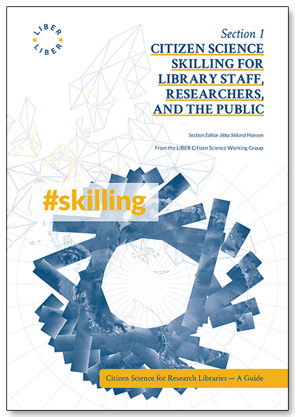

## Citizen Science Skilling for Library Staff, Researchers, and the Public

\#CS4RL

An open access and peer-reviewed book

Section Editor Jitka Stilund Hansen

Part of the four part book series: Citizen Science for Research Libraries — A
Guide

Published by the LIBER Citizen Science Working Group

© 2021 the authors. Licensed [Creative Commons: Attribution-ShareAlike 4.0 International](https://creativecommons.org/licenses/by-sa/4.0/) (CC BY-SA 4.0), unless otherwise stated.

Read online, DOI: <https://doi.org/10.25815/hf0m-2a57>

ISBN Print: 978-87-94233-59-0

ISBN eBook: 978-87-94233-60-6

A practical guide designed to assist those organising and participating in a
citizen science project to get the most out of the experience. The guide will
enable you to have the skills to ensure a project is well set up from the start,
is able to communicate to its stakeholders and citizens, manage its data and
outputs, and overall ensure research benefits. The guide has been compiled by
the LIBER Citizen Science Working Group and pulls on the generous contributions
of the open science community.

## Table of contents

**Subsection: Project Planning and Communications** \| Project Planning: A
Step-by-Step Guide; Stakeholder Matrix. By Line Laursen and Thomas Kaarsted \|
Communication; Communication Plan (Citizens); Project Highlight: Find a Lake. By
Lotte Thing Rasmussen \| **Subsection: Management of Citizen Science Data** \|
Research Data Management: Quick Start Guide (eLearning course) \| Use of Data
Policies in Citizen Science Projects: A Step-by-step Guide. By Jitka Stilund
Hansen \| Citizen Science Data and Standards; Project Highlight: Defining New
Data Standards with Citizen Science. By Sven Schade and Chrisa Tsinaraki \|
Acknowledgment of Citizen Scientists on Research Outputs; Project Highlight:
Lizard Conservation with the Balanggarra Rangers in Australia. By Georgia
Ward-Fear \| Planning and Securing Resources — The Data Management Plan. By
Iryna Kuchma \| Project Highlight: FAIR Data in a Citizen Science Project \|
Project Highlight: The INOS Project \| **Subsection: Scientific Literacy** \|
Increasing Scientific Literacy with Citizen Science. By Berit Elisabeth Alving.

## Editorial

**Editorial Committee:** Paul Ayris (Chair), Bastian Greshake Tzovaras, Jitka
Stilund Hansen, and Kirsty Wallis **Co-Editors-in-Chief:** Thomas Kaarsted &
Simon Worthington **Reviewers:** Sara Decoster & Stefan Wiederkehr.

**Correspondence:** Simon Worthington, <simon.worththington@tib.eu>
